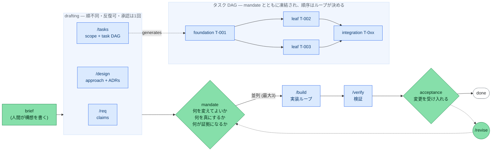

# Loose Rein
<!-- README.md: 67918588c3fd -->

[English](README.md) | **日本語**

**Human on the Loop** でソフトウェアを開発するためのコーディングエージェント用ハーネス。作業と
証拠の生成はエージェントが行い、人間はフェーズ境界 —— *ゲート* —— で承認する。

ハーネスの本体はインストール型の CLI (`rein`) である。リポジトリが持つのは状態だけで、`.rein/`
(SSOT・ロック・実体化されたプロンプトとスキーマ)と `docs/`(成果物)がそれにあたる。

このページは導入と運用の手順である。verb の一覧は `rein help --all`、各 verb の引数は
`rein <verb> --help` が示す。もう半分が [`AGENTS.md`](AGENTS.md) で、これはエージェント向けで
あると同時に人間が読むものでもある —— 常に真であるルールと、その根拠。なぜゲートがそこにあるか、
claim をどう判定するか、なぜレビューを plan を見ていない読み手から取るか。「どう動かすか」では
なく「なぜ信用できるか」を知りたいときはそちらを読む。

## しくみ
<!-- README.md: b16ecd7659cf -->

**人間が承認するのは2回。そのどちらも、作業の順序についての承認ではない。**



緑は人間が行う箇所 —— brief・ゲート・`/revise` である。青はエージェントが実行するもの。点線の矢印は
人間の裁量による差し戻しを表す。

| フェーズ | コマンド | 何が起きるか | 人間の役割 |
|---|---|---|---|
| drafting | `/req` `/design` `/tasks` | claim・方針・スコープ・タスク DAG —— 順不同 | **mandate** を承認する: スコープ・claim・受入基準 |
| 実装 | `/build` | mandate の内側での自律ループ | なし —— レビュー指摘は自分で修正する |
| 検証 | `/verify` | テスト・依存関係監査・grounded review | **acceptance** を承認する: 変更を受け入れる |

drafting の3コマンドは、3つで**1つの mandate** を書く。順序は変更に合わせて選んでよく、反復しても
よい。承認は1回で3つを覆う。省いてよいのは `/design` で、そのときトレーサビリティは design の次元を
「通った」ではなく**未検査**として報告する。`/req` と `/tasks` は省けない: `rein approve mandate` は
claim を1つも述べない plan と、タスクを1つも宣言しない plan を拒否する。

mandate を承認すると `plan.yaml` と `config.yaml` が凍結される。以後 `/build` が選べるのは順序・
並列度・再実行であり、mandate の `scope` の外のパスには触れられず、タスク DAG の切り直しもできない。
分割をやり直すなら `/revise --to mandate` を通る。

**3種類目のゲートは、変更がそれを持つときに現れる。** 不可逆だと宣言したタスク —— データが動く、
バージョンが公開される、課金が発生する —— には、そのタスクの名前を持つゲートが生まれ、`rein build`
はその手前で止まって `rein approve T-NNN` を待つ。これらは mandate の承認時に現れるので、回数も
mandate の一部として承認することになる。上限は設けていない: 何回聞かれるかは変更の性質である。

**ゲートを開けるのは人間だけである。** `rein approve` は対話的な端末を必要とするので、パイプ・CI
ジョブ・エージェントのサブプロセスはいずれも失敗する。`--force` は存在せず、ゲート行の手編集は
編集・commit・CI の各段階で拒否され、ゲートを開く verb を事前承認している設定ファイルが無いことを
`rein doctor` が検査する。`/revise` による承認の巻き戻しも同じく人間だけの権限である。

## セットアップ
<!-- README.md: 53266d1c1416 -->

6手順。`rein doctor` はいつでも全項目を点検できるので、green になった時点で新しいエージェント
セッションを開き、`/req` から始めればよい。

**1. 前提** —— POSIX 環境と、サンドボックス用のコンテナランタイム(docker または podman)。

| 環境 | |
|---|---|
| Linux・WSL | 対応 |
| macOS | 対応 |
| Windows native | **未検証** |

注意が要るのは Windows native で、**起動を拒否しない**からである: ファイルロックは `msvcrt` に
フォールバックし、ディレクトリの `fsync` は省かれ、並列ビルドが使うコントロールプレーンは Unix
domain socket を前提にし、ハングした command ステップの子プロセスは `killpg` が無いために残る。
WSL を使うこと。

**2. CLI を導入する** —— フックが PATH 上で解決できるようにする:

```bash
uv tool install 'git+https://github.com/komoroko/loose-rein-kit.git@vX.Y.Z'   # `rein` が入る
# vX.Y.Z は最新のリリースタグに差し替える: https://github.com/komoroko/loose-rein-kit/releases
```

**3. ヘッドレスのエージェント CLI を用意する** —— 実装フェーズが呼び出す対象である。既定は `claude`
で、`rein agent <cli>` により切り替える。起動できるのは7つ(現在の割り当ては `rein agent --show`、
PATH 上の有無は `rein doctor` が示す):

| `adapter:` | 実行ファイル | model 指定 | リトライがセッションを継続 | 消費量の報告 |
|---|---|---|---|---|
| `claude` | `claude` | 可 | 可(読解の共有もフォークできる) | 可 |
| `codex` | `codex` | 可 | 可 | 可 |
| `gemini` | `gemini` | 可 | 不可 | 可 |
| `copilot` | `copilot` | 可 | 不可 | 不可 |
| `cursor` | `cursor-agent` | 可 | 不可 | 不可 |
| `amp` | `amp` | 不可 | 不可 | 不可 |
| `opencode` | `opencode` | 可 | 不可 | ステップが報告したときのみ |

表の下の行を選ぶ場合、実際に効いてくる制約が2つある。

- model を指示できないアダプタは、隣に書かれた `model:` を**拒否する**。自分の既定モデルを別の名前で
  起動することはしない。
- 標準入力からプロンプトを読むのは `claude` と `codex` の2つで、他は引数として受け取る。引数1つの
  上限は OS 側で 128 KiB である。grounded review の reading は通常それを超えるので、他のアダプタでは
  128 KiB 程度を超える変更に対してレビュアーの起動が**拒否される**。レビュアー役を `claude` か
  `codex` に向けるか、`review_policy.budgets.max_diff_bytes` を下げること。

実行ファイルが無ければ `rein build` は起動せず、それをインストールするコマンドを示す。

**4. リポジトリを初期化する** —— 新規でも既存でも同じコマンドを使う。既存かどうかは自動で判定される。

```bash
cd myrepo && git init

rein start   # ウィザード: プロダクト名・brief の1行・エージェント連携ファイル・サンドボックス
# 非対話で行う場合(何度実行しても安全):
#   rein init --name <product> [--branch build/<product>]
```

**5. エージェント連携ファイルを配置する** —— フェーズコマンド(`/req`・`/design` など)は、これが
書かれて初めて存在する。通常はウィザードが行うので、次は2つめのホストを足すときや、非対話で初期化した
リポジトリに入れるときに使う:

```bash
rein install claude         # .claude/ のラッパー + settings.json のマージ
rein install copilot        # .github/ の prompt / agent / hook ラッパー
rein install codex          # .agents/skills/ と .codex/ のラッパー
rein install gemini         # .gemini/ の commands / skills + settings.json のマージ
```

これらはセッションやエディタの起動時にのみ読み込まれることが多い。実行後は**新しい**セッションを
開くこと。

**6. サンドボックスイメージをビルドする** —— 品質ゲートは、リポジトリのコードとテストをホストでは
なくサンドボックス内で実行する。エージェントが書いたテストを利用者の資格情報つきで実行させない
ためである。pin が完了するまで `rein doctor` は FAIL を報告する:

```bash
rein oci build --all --write-config   # docker か podman が必要
```

同梱イメージに入っているのは python・uv・pytest だけで、ネットワークも無い。同梱の既定ゲートを
動かすには足りるが、それ以上は動かない。リンタ・型検査・依存関係の解決を要するゲートには専用の
イメージが要る: Containerfile を書き、プロファイルの `containerfile:` を `dockerfile:` に置き換えて
指し、ビルドし直す(`.rein/config.yaml` の `SANDBOXES` ブロック)。

**エージェント CLI 自身を包む**のは任意で、既定は無効である。イメージが CLI を内包する必要がある
ためである:

```bash
rein oci build --profile agent --build-arg AGENT_CLI=@anthropic-ai/claude-code --write-config
```

以後、実装者・レビュアー・fixer はすべてその中で起動する。worktree は `/work` にマウントされ、
そして**利用者の HOME も ~/.ssh も ~/.aws も docker socket も無い**。egress は与えられる —— モデル
API に到達できないエージェントは何もできない —— ので、これは情報持ち出しに対する境界では**なく**、
そう主張もしない。どちらで動いたかは `rein doctor` が必ず述べる。箱に入れる場合はアダプタ側の
サンドボックスを無効化すること —— 入れ子のサンドボックスはエージェントが書き込む地点で失敗する。

## 使い方
<!-- README.md: 1da5101373a6 -->

日常的に使うのは次の3つで、それ以外はダッシュボードのボタンに相当する操作である。

```bash
rein start        # 初回: セットアップウィザード / 以降: 前回見たときから動いたもの
rein next         # 次に実行すべきコマンドだけ(連携用に --json)
rein ui           # ローカルダッシュボード。成果物を読み、その場で承認できる
```

日常的にではなく最初に一度設定するもの: `rein agent codex` はヘッドレスで使うエージェント CLI を
切り替え、`rein project add` はダッシュボードの切替対象にリポジトリを登録する。単発であれば
`rein --repo <path> <verb>` でディレクトリを移動せずに別のリポジトリを対象にできる。

1サイクルは次の手順で進む。

1. **brief を書く** —— `docs/00-product-brief.md` に「何を作りたいか」を数行。人間が書く出発点は
   これだけである。

2. **フェーズを実行する** —— 次のコマンドは `rein next` が示す。`/status` は同じ内容を、タスク DAG と
   ともにチャットへ出力する。

3. **ゲートを開く** —— 場所は2つあり、端末で `rein approve <gate>` を実行するか、成果物を読んだ
   `rein ui` の画面のまま承認する。どちらも事前に承認可能かを確認し、その承認が対象とする digest を
   表示する。

   ```bash
   rein approve acceptance
   #   gate 'acceptance' is ready. This approval will cover:
   #     plan_digest          sha256:…
   #     attested_chain_root  sha256:…
   #   Approve gate 'acceptance'? [y/N] y
   ```

4. **修正を求める** —— 成果物が適切でない場合の正規の選択肢である。プロンプトで no と答えるか、
   ダッシュボードの *Request changes* を使う:

   ```bash
   rein changes add requirements --target docs/10-requirements.md#R-3 \
                                 --reason "受入基準が計測不能"
   ```

   未対応の要求がある間、ゲートは閉じたままになり、登録したセッションが終了しても失われない。
   `--target` で箇所を指定すると、エージェントはその部分だけを修正するので文書全体の再生成には
   ならない。応答は `rein changes address <id> --note <何を変えたか>` で行う。

5. **差し戻す** —— ゲートを承認した**あとで**上流の不備が見つかった場合は `/revise <phase>` を実行
   する。戻し先から下流のゲートが連鎖的に `pending` へ戻る。`rein revise --impacted T-00x` は、指定した
   起点タスクとその下流をまとめて `needs-revision` にする。基盤タスクを起点にすると下流のほぼ全体が
   含まれるため、起点は狭く選ぶとよい。

6. **進捗を確認する** —— `rein start` は冒頭に **Waiting on you** を置く。リポジトリと次のゲートの
   間にある課題を重大な順に並べ、それぞれを解消するコマンドを示す。`rein ui` は同じものをページに
   したもので、このサイクルのゲートが左端の spine に並び、それぞれの背後に読み室があり、ほかに
   DAG・イベントログのライブ表示・診断がある。操作は固定ホワイトリスト —— 読み取り・診断・意思決定の
   記録に限られ、フェーズ実行や push は行えない。ほかに `rein dag --mermaid` が依存図を生成し、
   `rein decisions` と `rein claims` がアーカイブを読み戻す。

7. **PR にする** —— `rein pr-draft` が SSOT から PR 本文を組み立て、`.rein/pr-draft.md` に出力する。
   PR の作成と push は人間が行う。1タスク1PR の**スタック**として出すこともできる:
   `rein pr-stack` は各タスクが着地したコミットで作業ブランチを切り分け、スライスごとに本文を書く。
   `--push` は端末で確認を取ってから draft として開き、`--ready` は acceptance の承認後に draft を
   外し、`--restack` は修正をマージで上へ伝播させる。**スタックを rebase してはならず、部分的に
   マージしてもならない** —— どちらも記録が指すコミットが失われる結果になる。全体の着地は
   `gh stack merge <top> --merge` で行う。これには `gh extension install github/gh-stack` が要り、
   導入済みかどうかは `rein doctor` が答える。任意で `rein issue-sync` が plan のタスクを
   GitHub Issues へ一方向ミラーする(既定は off)。

8. **サイクルを閉じる** —— `rein cycle-close --name <slug>` が docs を `docs/archive/<日付>-<slug>/` へ
   アーカイブし、新しいスキャフォールドを復元し、ゲートとフェーズをリセットする。ゲートを開くのと
   同様、これも人間の操作である。

**順番が来たことを知る。** `rein ui` は起動している間 SSOT を監視し —— ブラウザは不要 —— 人間を
待っている判断が変わったときに指定のコマンドを実行する:

```yaml
# $XDG_CONFIG_HOME/rein/notify.yaml   (~/.config/rein/notify.yaml)
command: notify-send "rein"
```

コマンドは `REIN_PROJECT`・`REIN_DECISION_ID`・`REIN_HEADLINE`・`REIN_ACTION`・`REIN_URL` を環境に
持って実行される。1つの判断につき通知は1つで、内容は「何を待っているか」と「どこで答えるか」に
限られる —— 証拠は載らず、答える手段も載らない。指し示すページは、そのブラウザが既にセッションを
持っていなければ読み取り専用である。

## 設定できるもの
<!-- README.md: 5a52dd541f6d -->

つまみはすべて `.rein/config.yaml` にあり、その場にコメントが付いている。以下はそのうちプロジェクトが
普通に触るものである。既存リポジトリでは `rein init` が、認識できた品質ゲートのコマンドだけを埋める。

| キー | 何を決めるか |
|---|---|
| `quality_gate` | 単一の DoD 定義: `test`、次に `check`、次に `review` ステップ、次に実行可能な成果物に対する `smoke` 起動(動くようになったら `required: true` にする)。コマンドはプロジェクト自身のもので、各ステップは自分のリトライ予算を持ち、`paths:` で適用範囲を絞れる |
| `execution.max_parallel` | リーフタスクの同時実行数。`git worktree` で隔離され、タスク ID の昇順にマージされる |
| `execution.agent_timeout_sec` | 既定は `0`(制限なし)。時計は、動いているモデルと詰まっているモデルを区別できないため |
| `execution.command_timeout_sec` | 1つの command ステップの上限(既定 1800)。所要時間が分かるのは command ステップの側だからである。超えるとステップとそれが起動したものをまとめて kill する |
| `execution.max_cost_usd` | 既定は未設定。束縛するのはサイクルの*計測された*消費 —— アダプタが報告した値、`rein events --cost` が印字する数字 —— で、到達するとバッチの切れ目でループが止まる。上限に収めるために品質が落ちることはない |
| `review_policy.repair_rounds` | 実装者が指摘を解消したあと、レビュアーが読み直す回数 |
| `guard.paths` | pending のゲートが凍結する範囲 |

**無人での実行。** `rein build` の終了コードが信号である: `0` は完了、`1` と `2` は人間を必要とし、
`3` は一時的 —— 容量制限、シグナル、別の実行がロックを保持している —— で、何も記録せず予算も消費
しないので再実行してよい。`rein build --supervise` は `3` を自動でリトライし、
`rein review generate --supervise` はレビューパイプライン側で同じことを行う。

## インストールを最新に保つ
<!-- README.md: 255e3f29a108 -->

- **`rein sync`** —— インストール済みパッケージからプロンプトとスキーマを再実体化する。未変更の
  ファイルは更新し、ローカルで変更したファイルは保持して一覧に表示する(`--force` で上書き、
  `--check` は書き込まずに差分を報告する)。
- **`rein upgrade`** —— CHANGELOG の差分を表示したうえで、ツールが実体化したものをすべて更新する。
- **`rein doctor`** —— ネットワークに触れる唯一のコマンドである。GitHub に新しいリリースの有無を
  問い合わせ、**このインストールを実際に前へ進めるコマンド**を表示する。`gh` が無い・オフライン・
  VCS 由来でないインストールの場合は、「最新である」ではなく「確認できなかった」と報告する。
  `REIN_NO_UPDATE_CHECK` を設定すると問い合わせ自体を行わない。

## 利用者が設定するリポジトリ設定
<!-- README.md: 8dfe71b30049 -->

Loose Rein はこれらを読んで診断するが、設定はしない。自分を裁く検査を自分で付与できるツールは、
境界ではないからである。

| 設定 | 理由 |
|---|---|
| base ブランチを保護する(直接 push 禁止・PR 必須) | ハーネスが強制するゲート境界はすべて作業ブランチ上にあり、直接 push はその全部を迂回する |
| テストジョブと base 側 policy check を必須にする | `policy-check` は PR が偽装できない唯一の検査である —— 信頼できる base 側から head のツリーを読む。必須にしなければ助言に留まる |
| 新しいコミットで既存の承認を取り消す | 承認の対象は diff であって、ブランチ名ではない |
| `.rein/` やワークフローを変更する PR の自己承認を禁止する | それらは境界そのものである |
| CI でのシークレットスキャン | commit 段階のフックは、それを導入した開発者しか守らない |

`rein doctor` はローカルから見える範囲を報告する。ジョブ自体はここに書き下しておく。ステップの
順序に意味があり、しかもそれが他の多くのジョブの順序とは違うためである:

```yaml
  policy-check:
    if: github.event_name == 'pull_request'
    runs-on: ubuntu-latest
    steps:
      - uses: astral-sh/setup-uv@<commit sha>
      # チェックアウトより前に、かつ head が書いていないコミットから導入する。そうしないと、PR が
      # 自分の検証器の依存解決先を選べてしまう(依存は起動時に import される)。`--no-config` は、
      # 順序を入れ替えただけでそこが黙って再び開かないようにするためのもの。`uv tool install` は
      # bin ディレクトリを PATH に追加しないので自分で指定して追加する —— `runner` はジョブ階層の
      # `env:` からは読めないコンテキストなので、ステップに置く。
      - env:
          UV_TOOL_BIN_DIR: ${{ runner.temp }}/rein-bin
        run: |
          uv tool install --no-config \
            "git+https://github.com/komoroko/loose-rein-kit.git@<.rein/rein.lock のタグ>"
          echo "$UV_TOOL_BIN_DIR" >> "$GITHUB_PATH"
      - uses: actions/checkout@<commit sha>
        with:
          fetch-depth: 0
      - run: >-
          rein policy-check
          --base-sha '${{ github.event.pull_request.base.sha }}'
          --head-sha '${{ github.event.pull_request.head.sha }}'
          --base-ref '${{ github.event.pull_request.base.ref }}'
          --default-branch 'origin/${{ github.event.repository.default_branch }}'
```

古い形のままのジョブが遡って失敗することはない: base 側が報告するのは head が**持ち込んだ**もので
あり、既存のものを名指しするのは `rein doctor` の役目である。

## セキュリティ
<!-- README.md: 8bb0b5f4553b -->

- **gitleaks** を pre-commit で実行する。誤検知は `.gitleaksignore` に入れる。
- **構造化されたセキュリティレビュー**と**依存関係監査**が acceptance の前に走る。blocking の指摘は
  変更がそれを解消するまでゲートを閉じたままにし、解消したかどうかは、レビュアーに尋ねることでは
  なく、その指摘がアンカーしたコードを次の生成が読み直すことで決まる。
- コード上のアンカーを持たない指摘は、人間による異議申し立てによってのみ閉じる。

## 既存リポジトリへの導入(brownfield)
<!-- README.md: 522b8314a0a5 -->

専用の導入コマンドは無く、`rein init` が既存のコードベースを自動検出する。そのモードでは
`guard.paths` を docs の成果物だけに絞り —— pending のゲートが既存コードを凍結しないようにするため
である —— 認識できる範囲で品質ゲートのコマンドを埋め、brief から `/onboard` を指す。既存ファイルが
上書きされることはない。そのうえでリポジトリの中で:

1. **`/onboard`** がコードベースを読み取り専用で調査し、恒久的なベースラインである
   `docs/05-current-state.md` を埋める。既存の振る舞いを要件や完了タスクへ逆生成することは**しない**。
   トレーサビリティが覆うのは各サイクルの差分だけである。途中まで進んでいた作業は *absorb タスク* が
   受け止め、その部分的なコードを green に固定してから新しい作業を積む。
2. **差分サイクル** —— brief から `/verify` までの1周が1つの変更を記述し、`rein cycle-close` で閉じる。
   brief と `docs/05-current-state.md` はサイクルをまたいで残る。
3. **いつでも撤回できる** —— `rein uninstall claude|copilot|codex|gemini` はエージェント連携面を撤去し
   (未変更のファイルのみ。設定のマージはエントリ単位で戻す)、`rein uninstall --all` は実体化された
   成果物とロックをすべて削除する。SSOT と `docs/` には触れない。

## トラブルシューティング
<!-- README.md: 75829048e605 -->

**まず `rein doctor`** —— PATH 上の実行ファイルやフック登録から、plan と state の整合、レビューの
鮮度、サンドボックスの pin、スキーマ検証まで、全体を読み取り専用で診断する。以下の多くはここに現れる。

- **タスクが `blocked` になった** —— 品質ゲートがリトライ予算の内で失敗した。`rein events --render` で
  エスカレーションを読み、原因を直し、`rein task reset T-NNN --reason "…"` でタスクをフロンティアに
  戻す。`state.yaml` の手編集では行わない: `rein guard` が手編集を拒否する。reset は handoff を保持
  するので、リトライ予算が黙って補充されることはない(`--fresh` は破棄し、そう述べる)。原因が上流の
  不備なら `/revise <phase>` を使う。
- **ビルドが「人を待っている」で止まった** —— タスクの `requires` の probe が失敗したか、
  `produced_by: person` のタスクのファイルがまだコミットされていない。メッセージは最初に見つかった
  1つではなく、残りの計画が人に求めるものをすべて挙げる。用意してから `rein build` を再実行すれば、
  起動の前にそれぞれを確かめる。同じ一覧は計画が凍結された時点で `rein approve mandate` も出す。
- **計画に書かれていない順序で、あるタスクが別のタスクを待つ必要がある** —— `rein task order T-NNN
  --after T-MMM --reason "…"` で依存辺を足す。順序は mandate が承認したものの一部ではないので、
  巻き戻しは要らない。依存辺は記録され、acceptance で示される。
- **タスクが `awaiting-evidence` で止まっている** —— 受入基準の1つが `external`(ステージング確認・
  実機・人)である。`rein evidence show` が external の受入基準と観測済みかどうかを一覧する。作業は
  マージ済みで、誰かが見たものを `rein evidence record` で記録するまで待つ。
  その記録は対象としたツリーに束縛されるので、コードを変えれば失効する。
- **実行が止まったが、どこもおかしく見えない** —— blocked のタスクもエスカレーションも無く、ボードも
  動いていない。これはタスクの失敗ではなく機械の失敗である: 容量制限、プロセスの kill、CLI の不在。
  `rein doctor` と `rein start` がそれを名指しする。終了コードが `3` なら、容量が戻ってから
  `rein build` を再実行すればよい。各タスクは状態もリトライ予算も保持している。
- **ループが中断した**(Ctrl-C、クラッシュ)—— `rein build` を再実行する。起動時に `in-progress` の
  タスクを戻し、残った worktree を掃除する。中断されたリーフのコミットは salvage ブランチに保持され、
  次の試行にマージして戻される(コンフリクトは報告され、強制はされない)。
- **ゲートガードに編集を拒否された** —— ゲートが pending の状態で次フェーズの成果物を編集している。
  これは仕組みが働いている状態である。ゲートを承認してもらうか、`/revise` で差し戻す。迂回路は無い。
- **「template placeholders」と言われる** —— 先に `rein start`(または `rein init --name <product>`)を
  実行する。
- **フックで `rein: command not found`** —— CLI が PATH 上に無い(セットアップの手順2)。
- **フェーズコマンドがエージェントに現れない** —— 連携面が未導入である:
  `rein install claude|copilot|codex|gemini` を実行し、新しいセッションを開く(セットアップの手順5)。

## リポジトリ構成
<!-- README.md: 3f87d7a7c42c -->

`rein init` が書き込むのは**状態だけ**である: SSOT の各文書、docs のスキャフォールド、実体化された
プロンプトとスキーマ、ロック、`AGENTS.md` に追記されるマーカー付きのポインタブロック、そして作業
ブランチ。ビルドファイルは書かず、`rein install` しない限りエージェント連携面も書かない。既存
ファイルが上書きされることはない。オーケストレーションのコード自体はインストール済みパッケージの
中にあり、リポジトリには入らない。

| パス | 役割 |
|---|---|
| `.rein/plan.yaml` | 凍結された Expected Model: 要件ごとの claim と、タスク DAG |
| `.rein/state.yaml` | 可変の状態: フェーズ、ゲート承認、タスクの状態 |
| `.rein/review.yaml` | 機械レビューと人間レビュー(別々に digest される) |
| `.rein/events.ndjson` | ハッシュ連鎖した監査ログ。各起動はプロバイダが課金した量を記録するので、`rein events --cost` がサイクルのトークンの行き先を役割別に答える |
| `.rein/config.yaml` | 決定論的実行のつまみと、単一の DoD (`quality_gate`) |
| `.rein/rein.lock` | 文書フォーマット、ツールのバージョンと取得元、導入ファイルごとの内容ハッシュ |
| `.rein/prompts/` | 全エージェントが読むフェーズ手順・役割定義・ルールモジュール(パッケージから実体化) |
| `AGENTS.md`・`CLAUDE.md` | エージェント非依存の運用ルールと、それを読み込む Claude Code 用の能力マッピング |
| `.claude/`・`.github/` | エージェントごとの入口とゲートガードのフック登録(`rein install` によるオプトイン) |
| `docs/` | 各フェーズの成果物、投機的作業ログ、レトロスペクティブ |

## エージェント対応
<!-- README.md: a2c1b7bb6436 -->

Loose Rein は **Claude Code** と **VS Code GitHub Copilot**(フック強制のゲートを含む完全対応)、
そして **Codex**・**Gemini CLI**・`AGENTS.md` を読むその他のエージェント(ルールと手順は伝わり、
ゲートは規約として機能する)で動作する。

| 能力 | Claude Code | VS Code Copilot | Codex | Gemini CLI |
|---|---|---|---|---|
| フェーズの入口 | スラッシュコマンド | prompt ファイル | skills | カスタムコマンド |
| ゲートの強制 | PreToolUse フック | agent hooks(プレビュー) | `apply_patch` フック | `BeforeTool` フック |
| 構造化された質問 | AskUserQuestion | チャットの番号付き選択肢 | チャットの番号付き選択肢 | チャットの番号付き選択肢 |
| 承認の提示 | plan mode | plan mode | 明示的な「承認」 | 明示的な「承認」 |
| 役割の委譲 | subagents | カスタムエージェント | subagents | skills |
| ビルドの CLI として選択 | `rein agent claude` | `rein agent copilot` | `rein agent codex` | `rein agent gemini` |
| ゲート待ちの通知 | PushNotification | ターン終了 | ターン終了 | ターン終了 |

どのホストでも commit 段階の検査は働き、フックが無い場所を支えるのはそれである。注意点が3つある。
Codex 向けの連携面は**実機の Codex に対して未検証**である(加えて Codex はプロジェクトが信頼される
まではプロジェクト単位の設定を読まない)。VS Code Copilot の agent hooks は**プレビュー**機能であり、
無効なら規約としてゲートが機能する。そして役割の委譲が使えない環境では、並列のリーフタスクは直列に
縮退する。どのフックホストが登録されているかは `rein doctor` が報告する。
