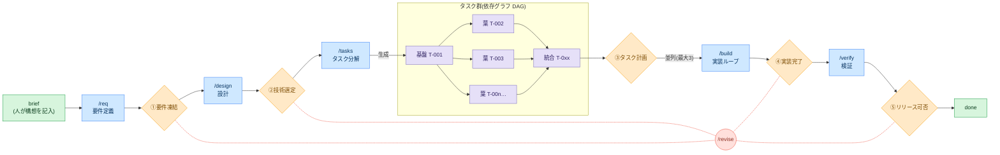

# Loose Rein

[English](README.md) | **日本語**

**Human on the Loop** で開発を進めるための、コーディングエージェント用ハーネス。要件定義から
テストまで、実作業も成果物づくりも自己テストもエージェントが担う。
**人間はフェーズの境目にある「ゲート」で承認・判断する。それだけでいい。**

ハーネス本体は**インストールして使う CLI**(`rein`)。プロダクトのリポジトリに残るのは*状態*
だけで、`.rein/`(SSOT〈信頼できる唯一の情報源〉・lock・実体化した prompts/schema)と
`docs/`(フェーズ成果物)の2つ。

**Claude Code** と **VS Code GitHub Copilot** はフックによるゲート強制まで含めてフル対応
(Copilot のフック機構は VS Code の preview 機能)。**Codex** をはじめ `AGENTS.md` を読む
エージェントも、規約と手順のレベルで動く(ゲートは慣習で保つ)。詳しくは「エージェント対応」を
参照。

## 全体の流れ



- 🟦 エージェントが実行するフェーズ
- 🟧 ゲート①〜⑤ — **人間だけ**が開ける
- 🟩 人間の関与ポイント
- 🟪 タスク — DAG: 基盤 → 並列の葉 → 統合
- 🟥 `/revise` — 上流への差し戻し(赤い点線)

流れは左から右へ。**前提のゲートが未承認のあいだは、次のフェーズに進めない。** `/build` は
タスク群を最大3並列で消化する。`/revise` は戻し先から下流のゲートを連鎖的に `pending` へ
戻す。これも、人間が決めたときだけ起きる。

## どこから始めるか

CLI のインストールは最初の一度だけ(「セットアップ」参照)。あとは状況で入口が決まる:

| いまの状況 | 入口 |
|---|---|
| ゼロから新しいプロダクトを作る(greenfield) | 「セットアップ」→「使い方」 |
| 開発中の既存リポジトリに導入する(brownfield) | 「セットアップ」(`rein init` が自動判定)→ `/onboard` |
| 導入済みのリポジトリで次の変更を始める | 変更内容を `docs/00-product-brief.md` に書いて `/req`。前のサイクルが開いたままなら、先に `rein cycle-close --name <slug>` |
| リリース判断(ゲート⑤)が済んだ | `rein cycle-close --name <slug>` — 今サイクルの docs をアーカイブし、次サイクルに向けてリセットする |
| 実体化されたツール群を更新したい | `rein upgrade`(取り除くなら `rein uninstall --all`) |
| 現在地が分からない・中断から再開する | `/status`(次に打つコマンドも出る)か `rein ui`(ローカルのダッシュボード) |

人間が日常的に打つのは、次の少数の動詞だけ。残りはダッシュボードのボタンに相当する操作で、
一覧は `rein --help` にある。

```bash
rein start        # 初回: 対話ウィザードでセットアップ / 導入済みなら現在地と次の一手を表示
rein next         # 次に打つべきコマンドだけを表示(連携用に --json あり)
rein ui           # ローカルダッシュボード — ゲートの成果物を読み、その場で承認まで行える
rein agent codex  # ヘッドレスで使うエージェント CLI を切替(claude | codex | gemini | 任意コマンド)
rein project add  # ダッシュボードのプロジェクト切替対象にリポジトリを登録
```

`project add` で複数のリポジトリを登録すると、ダッシュボードのヘッダに**プロジェクト切替**の
ドロップダウンが出て、サーバを立て直さずに対象を切り替えられる。`rein ui` は起動元のリポジトリを
必ず自動登録する。単発でよければ `rein --repo <path> <verb>`(または `REIN_ROOT=<path>`)で、
ディレクトリを移動せずに別のリポジトリを対象にできる。

## 設計原則

- **アーキテクチャ** — `rein build` は決定論的な DAG スケジューラ。各フェーズは専用のロール
  エージェントとして走る。
- **コンテキスト** — 真実は SSOT に置き、ロールエージェントは必要な分だけ読む。監査ログ
  `events.ndjson` はローテーションしない。詳細は `.rein/prompts/rules/gate-workflow.md` の
  「Context budget」。
- **ツール** — ロールエージェントへのツール付与は最小限・用途限定にし、品質ゲートにはリトライ
  上限を設ける。

## セットアップ

前提は POSIX 環境と、サンドボックス用のコンテナランタイム(docker/podman):

| 環境 | 状態 |
|---|---|
| Linux | 対応 |
| WSL | 対応 — Windows 機で動かすならこれ |
| macOS | 対応 |
| Windows native | **未検証。** 起動を拒否こそしないが、保証はない: ファイルロックは `msvcrt` にフォールバックし、ディレクトリの `fsync` は省かれ、並列ビルドが使うコントロールプレーンは Unix domain socket を前提にしている。WSL を使うこと。 |

フックが PATH 上の `rein` を解決できるよう、まず CLI を入れる:

```bash
uv tool install 'git+https://github.com/komoroko/loose-rein-kit.git@vX.Y.Z'   # `rein` コマンドが入る
# vX.Y.Z は最新のリリースタグに差し替える: https://github.com/komoroko/loose-rein-kit/releases
```

実装フェーズ(`rein build`)には、**ヘッドレスで動くエージェント CLI** も要る。既定は
`claude -p`。切り替えは `rein agent codex`(そのロールの adapter を `.rein/config.yaml` に
書き込む。`gemini` も使える)。用意がなければ `rein build` は起動を拒否し、`rein doctor` も
それを指摘する。

次にリポジトリを初期化する。コマンドは **greenfield**(新規)でも **brownfield**(既存)でも同じで、
brownfield かどうかは自動で判定される(詳細は「既存リポジトリへの導入」):

```bash
cd myrepo && git init            # 新規でも既存でも同じ

# 対話ウィザード(推奨)。訊かれるのはプロダクト名〔既定はフォルダ名〕と brief の1行だけ。
# ブランチは build/<name>、取得元はインストール元から自動検出、ヘッドレス CLI は既定のまま
# ——いずれも後から変更できる〔下記参照〕。
rein start
# 非対話で行う場合(何度実行しても安全):
#   rein init --name <product> [--branch build/<product>] [--source git+https://github.com/komoroko/loose-rein-kit]

# 任意・開発環境ごと。使うエージェントの入口は、必要になってから足す:
rein install claude         # .claude/ のラッパーを書き、settings.json をマージ
rein install copilot        # .github/ に prompt / agent / hook のラッパーを書く
rein install codex          # .agents/skills/ と .codex/ に agent / hook のラッパーを書く
```

エディタやエージェントの統合は、コマンド・プロンプトのファイルをセッションやエディタの起動時に
しか読まないことが多い。`rein install claude|copilot|codex` を実行したら、**新しい**セッションを
開くこと(エディタなら再起動する)。起動済みのセッションは、途中で増えたファイルを拾わない。
その新しいセッションで **`/req`** から始める(現在地と次の一手は、いつでも `rein next` が示す。
「使い方」参照)。

`rein init` が書き込むのは**状態だけ**:

- SSOT の4文書(`plan.yaml` / `state.yaml` / `review.yaml` / `config.yaml`、プレースホルダ入り)と
  docs のスキャフォールド
- 実体化された `.rein/prompts`・`.rein/schema`・`.rein/AGENTS.rein.md`、初期スキャフォールドの
  スナップショット、`.rein/rein.lock`(ツールのバージョン・取得元と、導入ファイルごとの内容ハッシュ)
- `AGENTS.md` へのマーカー付きポインタブロックの追記
- 作業ブランチの作成と切り替え(実装は main ではなくこのブランチで行う)、ゲートガードの有効化

これ以外には触れない。ビルドファイルも makefile も書かないし、エージェントの入口も
`rein install` するまでは入らない。brownfield なら `/onboard` への案内も添える。

実体化されたファイルを最新に保つには:

- `rein sync` — インストール済みパッケージから prompts/schema を再実体化する。手を入れていない
  ファイルは更新し、ローカルで変更したファイルは保持して一覧に出す(`--force` で上書き、
  `--check` は書き込まずズレの報告だけ)
- `rein upgrade` — CHANGELOG の差分を見せたうえで、ツールが実体化したものをすべて更新する
- `uv tool upgrade loose-rein-kit` — CLI 本体そのものを更新する

### サンドボックスイメージ

リポジトリのコードとテストは、ホストではなくサンドボックスの中で走らせる。そうなるまで
`rein doctor` は FAIL を出し続ける。エージェントが書いたテストファイルを、あなたの資格情報つきで
実行させないための線引き。最初の `/build` の前に:

```bash
rein oci build --all --write-config # 3つの同梱イメージをビルドして pin する(docker/podman が必要)
rein oci verify                     # pin が揃っているか確認する
```

`rein init`・`rein next`・ダッシュボードは、いずれも適切なタイミングでこれを促す。ウィザードなら
その場で実行もできる。独自 Containerfile・再 pin・実行時フラグといった詳細は、`.rein/config.yaml`
の `SANDBOXES` コメントブロックにある。

## 自分で設定するリポジトリ側の項目

Loose Rein はこれらを読んで診断するだけで、自分では設定しない。ブランチ保護・必須チェック・
シークレットはリポジトリ管理の領分であり、自分を裁くチェックを自分で付け外しできるツールは
境界にならないからである。ホスティング側で一度だけ設定しておくこと:

| 設定 | 理由 |
|---|---|
| `main` を保護する(直接 push 禁止・PR 必須) | ハーネスが守るゲート境界は、すべて作業ブランチ上にある。直接 push はその全部を迂回する。 |
| 必須チェックに `tests` と `base-side policy check` を入れる | `policy-check` は、プルリクエストが偽装できない唯一のチェック——信頼できるベース側から head ツリーを読むため。必須にしなければ、ただの参考値。 |
| 新しいコミットで古い承認を無効化する | 承認の対象は差分であって、ブランチ名ではない。 |
| `.rein/` や `.github/workflows/` を変更する PR の自己承認を禁じる | そこが境界そのもの。 |
| CI でシークレットスキャン(gitleaks) | コミット段階のフックは、それを入れた開発者しか守らない。 |

ローカルから見える範囲だけは `rein doctor` が報告する——ワークフローが `rein policy-check` を
実行しているかどうかで、していなければ WARN。残りはリポジトリ管理者の責務。なお `policy-check`
を導入するコミット自体は検証されない。それを検査すべき、より古いベース側の検証器がまだ存在
しないためである。

## 既存リポジトリへの導入(brownfield)

専用の導入コマンドはない。入口は `rein init` ひとつで、既存のコードベース(`src/`・
`package.json`・`pyproject.toml` など)を**自動判定**する。判定されると:

- `config.yaml` の `guard.paths` を docs 成果物だけに絞り、ゲートが未承認でも既存コードの開発が
  止まらないようにする(準備ができたら `src/: tasks` のようにコードのパスを戻す)。
- 品質ゲートの test/check コマンドを、認識できる範囲でプロジェクトのツールから埋める
  (`--test-cmd` / `--check-cmd` で上書き可能)。
- `docs/00-product-brief.md` に、`/onboard` を案内する導入メモを付ける。

既存ファイルは**決して上書きしない**(再実行しても安全)。導入後の流れは:

1. **`/onboard`** — 既存コードベースを読み取り専用で調査し、**恒久ベースライン**
   `docs/05-current-state.md` を作る。既存の挙動を要件や完了済みタスクへ逆生成することは
   **しない**。ゲートを開くのは常に人間であり、トレーサビリティ(R-N)が及ぶのは各サイクルの
   差分だけだからである。作りかけの実装があるときは、先頭に**吸収タスク**を置き、既存の部分実装を
   テストで green に固定してから新しい作業を積む。
2. **デルタサイクル** — `brief → /req → … → /verify` の1周で**1つの変更**を扱い、
   `rein cycle-close` で締める(進め方は「使い方」と同じ)。`docs/00-product-brief.md` と
   `docs/05-current-state.md` はサイクルをまたいで残る。
3. **いつでも撤去できる** — `rein uninstall claude|copilot|codex` はエージェントの入口を取り除く
   (対象は手を入れていないファイルのみ。settings のマージはエントリ単位で戻す)。
   `rein uninstall --all` なら、実体化された成果物と lock をすべて削除する。リポジトリ自身の
   状態(SSOT と `docs/`)には触れない。

## 使い方

1. `docs/00-product-brief.md` に「何を作りたいか」を数行で書く(人間が書く出発点はこれだけ)。
2. 次のコマンドを順に実行する。各コマンドは最後に承認を求めて止まる。

   | 手順 | コマンド | 何が起きるか | 人間の役割 |
   |------|----------|--------------|------------|
   | 要件 | `/req`    | 対話で要件を構造化する | ① 要件を凍結する |
   | 設計 | `/design` | 実装方針と技術選定の選択肢を出す | ② 技術選定を決めて承認する |
   | 分解 | `/tasks`  | テスト方針付きのタスク票を生成する | ③ タスク計画を承認する |
   | 実装 | `/build`  | ループで自律実装する(テスト green が完了条件) | ④ 実装をレビューして承認する |
   | 検証 | `/verify` | 機能テストと非機能テストを実行する | ⑤ リリース可否を判断する |

3. **ゲートを開く**。これは人間の行為であって、エージェントの行為ではない。開く場所は2つあり、
   どちらも先に開けられる状態かを確かめ、その承認が束縛する digest を表示し、同じ1本の記録経路に
   至る。receipt には、どちらの経路で確認したかが残る:

   ```bash
   rein approve build            # readiness を確認したのち:
   #   gate 'build' is ready. This approval will cover:
   #     plan_digest          sha256:…
   #     attested_chain_root  sha256:…
   #   Approve gate 'build'? [y/N] y
   #   gate 'build' opened (GA-BUILD-a1b2c3d4)
   ```

   もう1つは `rein ui`。成果物を読んだその画面のまま承認できて、追加の手数はない。

   **承認が、事故で・既定動作で・事前承認された設定経由で起きることはない。** `rein approve` は
   対話的な TTY を要求する(パイプされた stdin も、CI ジョブも、エージェントのサブプロセスも
   通らない)。ダッシュボードは、`rein ui` を起動した端末にしか印字されない使い捨ての起動リンクを
   使う。`rein doctor` は、設定ファイルがゲートを開ける動詞を事前承認していないか検査する。
   `--force` は存在せず、ゲート行の手編集はガードが拒否する。

4. **修正を求める**。成果物が正しくないときは、こちらが一級の答えであって、行き止まりではない。
   プロンプトで no と答えるか、ダッシュボードの *Request changes* を使う:

   ```bash
   rein changes add requirements --target docs/10-requirements.md#R-3 \
                                 --reason "受入基準が計測不能"
   ```

   未対応の要求がある間、**ゲートは閉じたまま**。要求は `state.yaml` に載るので、それを上げた
   セッションが終わっても消えない。`--target` で場所を指すと、エージェントはその断片だけを読んで
   直す(文書全体のやり直しにはならない)。応答は
   `rein changes address <id> --note <何を変えたか>`。これでゲートの閉塞が解け、ノートが承認画面に
   出る。

5. **差し戻す**。ゲートを承認した**あとで**上流(要件・設計)の不備が見つかったら
   `/revise <phase>` を実行する。戻し先から下流のゲートが、連鎖的に `pending` へ戻る。
   `rein revise --impacted T-00x` は、指定した起点タスクとその下流をまとめて `needs-revision` に
   する(自動で波及することはない)。起点に基盤タスクを選ぶと下流のほぼ全体が巻き込まれるので、
   起点は狭く取ること。
6. **進捗を確認する**:
   - `rein next` — 次に打つべきコマンドだけを表示する(連携用に `--json`)
   - `rein status` — 冒頭に **Waiting on you** を出す。リポジトリと次のゲートの間に立っている
     ものを重い順に並べ、それぞれの重要度と、片付けるためのコマンドを示す。blocking の行は
     `rein approve <gate> --check` が拒否する理由そのものなので、開かないゲートについてボードが
     「対応不要」と言うことは起きない
   - `/status` — 同じボードをチャットで示す(タスク DAG も併せて)
   - `rein ui` — ダッシュボードを開く。Overview ボードはこのキューを表示する。**Review タブ**では、
     承認待ちゲートの成果物を1画面で読み、そのまま承認できる(scope → 何が変わりどうレビュー
     されたか → この変更が人に何を要求するか → 未決着の claim・gap・finding を1件1枚で示す
     Decision Card。high/critical のカードが未回答のうちは freeze できない)。ほかに Tasks タブ
     (DAG・レイヤー進行)と Activity タブ(イベントのライブフィード)。ゲートやエスカレーション
     の待ちは、オプトインのベル通知で知らせる。操作は固定ホワイトリスト——読み取り・診断・
     意思決定の記録(approve / resolve / revise / cycle-close)だけで、フェーズ実行や
     push/PR/merge はここでは行えない
   - `rein dag --mermaid` — タスクの依存図を生成する
7. **PR にする**。`rein pr-draft` が SSOT から PR 本文を組み立て、`.rein/pr-draft.md` に書き出す
   (読み取り専用)。PR の作成や push は、従来どおり人間の操作。
8. **サイクルを閉じる**。ゲート⑤のあと `rein cycle-close --name <slug>` を実行すると、docs が
   `docs/archive/<日付>-<slug>/` へアーカイブされ、新しいスキャフォールドが復元され、ゲートと
   フェーズがリセットされる。ゲートを開くのと同じく、これも人間の操作。

### 実装フェーズを自律で回す

正式な手順は `.rein/prompts/commands/build.md` と `AGENTS.md`。

**`rein build`** は、どのタスクを・何並列で・どの順にマージし・いつ止めるかを、
`config.yaml`・`plan.yaml`・`state.yaml` から決定論的に決める。LLM の裁量には依存しない
(`--dry-run` を付ければ、エージェント CLI や git を呼ばずに制御フローだけ確認できる)。
手で同じことをする経路はない。`state.yaml` は機械が書くもので、手編集は `rein guard` が拒否する。
葉タスクの判断が監査チェーンに届く道も、オーケストレータが立てる control plane しかない。

ルール:

- タスクが完了になるのは、`config.yaml` の `quality_gate` を通過したときだけ。これが **DoD の
  唯一の定義**で、既定は `test` → `check` → `/code-review` + `/simplify` による review ステップ →
  起動できる成果物なら実起動の smoke テスト(起動できるようになったら、smoke ステップに
  `required: true` を設定する)。各ステップにはリトライ予算があり、使い切ると `blocked` になる。
  ステップは `paths:` で自分のスコープを絞れるので、複数スタックが混在するリポジトリでも無関係な
  分まで毎回払わずに済む(タスクごとのつまみではなく、gate ③ で凍結される config 側の判断)。
- **並列の葉タスクは** `git worktree` で隔離して走らせ(最大 `max_parallel`)、タスク id の昇順で
  マージする。解決できないタスクは `blocked`、上流の不備は `needs-revision` としてエスカレー
  ションし、ループは停止する。`gates.build` を開けるのは人間だけで、オーケストレータは触れない。

### 無人での再実行

`rein build` の終了コードが、次に何をすべきかを示す。`0` は全タスク完了(ゲート④へ)。`1`/`2` は
人間の対応が要る(エスカレーションを読むか、指摘箇所を直す)。`3` は容量切れ・シグナル・他の run が
ロックを保持中といった、時間が解決する失敗で、何も印を付けず予算も消費していないので、そのまま
再試行してよい。`rein build --supervise` は `3` を自動で再試行する(`--supervise-interval-sec`、
既定 900)。各停止の見分け方と対処は「トラブルシューティング」を参照。

> **DoD のコマンドはプロジェクト固有**: `quality_gate` に一度だけ書く。同梱の既定値
> `make test` / `make check` はプレースホルダで、brownfield では `rein init` が検出したコマンドを
> 埋める。それ以外の場合は、自分のプロジェクトのコマンドに置き換えること。

### セキュリティ検査

3つの層で担保する:

- コミット段 — **gitleaks** がシークレットのコミットを防ぐ(誤検知は `.gitleaksignore` へ)
- 実装完了時 — **構造化セキュリティレビュー**がゲート④の grounded review に組み込まれる。
  `rein review generate` がレビュー対象 HEAD に束ねて実行し、blocking な指摘はゲートを止める
- `/verify` — **セキュリティレビューと依存パッケージの脆弱性監査**が必須

指摘は散文ではなく構造化されており(severity・code anchor・blocking フラグ)、後続コミットが
入ると、再生成するまで review は stale になる。

### GitHub Issues 連携(任意)

**既定はオフ**。`github.enabled: true` で有効化する(`gh` CLI と GitHub remote が前提。なければ
自動でスキップ)。`rein issue-sync` は plan のタスクを Issues へ**一方向にミラー**する。タスク
T-NNN と Issue が1対1で対応し、不可視マーカー `<!-- rein:T-NNN -->` で突き合わせ、`kind:*` /
`status:*` / `risk:*` / `claim:*` ラベル(自動作成)を付ける。Issues 側で編集しても読み戻さない
(SSOT は常に `plan.yaml` + `state.yaml`)。Issue への書き込みは外向きの操作なので、オプトインが
そのまま同意の表明になる。

## トラブルシューティング

- **まずは `rein doctor`** — 環境と SSOT を読み取り専用で一括診断する(PATH 上のバイナリ、
  config/state/tasks の整合性、ゲート連鎖の不変条件、フック登録、worktree の残骸、未解決の
  エスカレーション、review の鮮度、sandbox の digest 固定、lock の健全性、schema 検証)。以下の
  症状の多くは、ここに FAIL / WARN として現れる。
- **タスクが `blocked` になった** — リトライ予算の中で品質ゲートを通せなかった、ということ。
  `rein events --render` でエスカレーションの内容を読み、原因(またはタスク票)を直したうえで、
  **`rein task reset T-NNN --reason "…"`** でフロンティアに戻し、`rein build` を再実行する。
  `state.yaml` を直接編集するのではない。あれは Central Store のトランザクション内でしか書かれず、
  手編集は `rein guard` が拒否する。この動詞がそのトランザクションそのもので、変更の隣に理由が
  記録される。handoff は既定で保持するので、リトライ予算が黙って満タンに戻ることはない
  (`--fresh` を付けると破棄し、破棄したという事実も記録される)。エスカレーションはログに残り
  続ける。追記専用で `resolve` に当たる動詞はなく、結論は `/verify` の回顧に書く。原因が上流の
  不備なら、代わりに `/revise <phase>`。
- **run が止まったが、どこにも異常が見当たらない** — blocked のタスクも、エスカレーションもなく、
  ボードは以前のまま。それはタスクの失敗ではなく機械側の失敗で、エージェントの容量制限、プロセスの
  強制終了、CLI の不在などが原因。`rein doctor` と `rein resume` がその正体を示す。終了コードが
  `3` だったなら、容量が戻ってから `rein build` を再実行するだけでよい。各タスクは status も
  リトライ予算も保ったままで、退避された作業も自動的に拾われる。
- **ループが中断した**(Ctrl-C・クラッシュ)— 別のターミナルからでも、そのまま `rein build` を
  再実行すればよい。起動時に `in-progress` のタスクを `todo` へ戻し、残った worktree も掃除する。
  中断した葉タスクのコミットは salvage ブランチに退避したうえで、次の試行の worktree にマージし
  直す(コンフリクトしたときは強制せず、その旨を記録する)。落ちたステップ・その出力・実際に
  残っているリトライ予算は `state.yaml.tasks.<id>.handoff` が引き継ぐ。つまり再実行は、やり直し
  ではなく続きから。
- **ゲートガードに編集を拒否された** — 前提のゲートが `pending` のまま、次フェーズの成果物を編集
  しようとしている。つまり仕組みが正しく働いている。ゲートの承認を得るか、`/revise` で巻き戻す
  こと。回避手段は存在しない——`gates.enforce_hook` のような迂回キーは受け付けず、持ち込もうと
  したプルリクエストは CI のベース側 `policy-check` が落とす。
- **「template placeholders」と言われて起動を拒否される** — 先に `rein start`(または
  `rein init --name <product>`)を実行する。
- **フック実行時に `rein: command not found`** — CLI を PATH に入れる(「セットアップ」参照)。
  フックのバイナリが見つからない状態は、`rein doctor` でも FAIL になる。
- **`/req` などのフェーズコマンドが、使っているエージェントに出てこない** — エージェントの入口は
  任意で、`rein start`/`init` が自動で用意するわけではない。使っているエージェントに合わせて、
  `rein install claude`(`.claude/commands/` を書き、`.claude/settings.json` をマージ)か
  `rein install copilot`(`.github/` 側のラッパーを書く)、`rein install codex`
  (`.agents/skills/` と `.codex/` 側のラッパーを書く)を実行すること。これらは多くの場合
  セッションやエディタの起動時にしか読まれないので、実行後は**新しい**セッションを開く(エディタ
  なら再起動する)。起動済みのセッションは、途中で増えたファイルを拾わない。

## リポジトリ構成

| パス | 役割 |
|------|------|
| `.rein/plan.yaml` | 凍結された Expected Model: 要件1件ごとの claim・タスク DAG |
| `.rein/state.yaml` | 可変な状態: フェーズ・ゲート承認・タスク状態 |
| `.rein/review.yaml` | マシンレビューとヒューマンレビュー(それぞれ独立に digest 化) |
| `.rein/events.ndjson` | ハッシュ連鎖された監査ログ — あらゆる状態変更の機械可読な真実(`rein events` で操作。最初のイベント発生時に作られる) |
| `.rein/config.yaml` | 確定実行の設定と、DoD の唯一の定義(`quality_gate`) |
| `.rein/rein.lock` | 文書フォーマット、ツールのバージョン・取得元、導入ファイルごとの内容ハッシュ |
| `.rein/schema/` | SSOT 各文書の JSON Schema(エディタでの検証と `rein doctor` が使う)— 実体化ファイル |
| `.rein/prompts/` | 全エージェントが読む、共有のフェーズ手順・ロール定義・フェーズ限定ルールモジュール(`rules/`)— 実体化ファイル |
| `.rein/AGENTS.rein.md` | エージェントの入口が import する運用規約の本体 — 実体化ファイル |
| `AGENTS.md` / `CLAUDE.md` | エージェント中立な運用規約の正本 / Claude Code 向けの能力対応表(Claude Code が読むのは CLAUDE.md であり AGENTS.md ではない。`@AGENTS.md` インポートで規約を一度だけ読み込む。`rein install claude` が、対応表ブロックと `.claude/` ラッパーを製品リポに書き込む) |
| `.claude/`・`.github/` | エージェント別の入口・ロールのラッパー・ゲートガードのフック登録(`rein install` で任意導入) |
| `docs/` | フェーズ成果物(要件・設計・ADR・タスク票・テスト計画) |

オーケストレーションのコード自体はインストールされた `rein` パッケージの中にあり、リポジトリには
置かれない。

## エージェント対応

規約(`AGENTS.md`)と手順(`.rein/prompts/`)はエージェント中立に書かれており、人間とのやり取りが
必要な箇所を**能力ボキャブラリ**という共通の語彙で表す。それを各エージェントでどう実現するかは、
エージェントごとの対応表ファイルが定める。

| 能力 | Claude Code | VS Code Copilot | Codex |
|---|---|---|---|
| フェーズの入口 | スラッシュコマンド(`.claude/commands/`) | prompt files(`.github/prompts/`) | skills `$req` …(`.agents/skills/`) |
| ゲート強制 | PreToolUse フック + コミット段のチェック | 同じフックを agent hooks(preview)で + コミット段のチェック | 同じフックを `apply_patch` に(`.codex/hooks.json`)+ コミット段のチェック |
| 人間への構造化質問 | AskUserQuestion | チャットで番号付きの選択肢 | チャットで番号付きの選択肢 |
| 承認の提示 | plan mode + ExitPlanMode | Plan モード / 明示的な「approve」 | 明示的な「approve」 |
| ロール委譲 | subagents | custom agents `@architect` など | subagents(`.codex/agents/*.toml`、明示委譲) |
| 自律ビルド | `rein build` | `rein build` | `rein build` |
| ゲート待ちの通知 | PushNotification | ターン終了時に明示 | ターン終了時に明示 |

対応表を持たないエージェント(AGENTS.md だけを読むもの)は、`AGENTS.md` の能力ボキャブラリ表に
ある劣化列に従う。

- エージェントの入口はオプトインで、`rein install claude|copilot|codex` が書き込む。これらは
  インストール済みの `rein` CLI を呼び出すので、フックの前提として `uv tool install` が要る。
- Codex 側は **実機で未検証**。フックのペイロード形と、skills・subagents の探索パスは、
  openai/codex のソースと公式ドキュメントから確定させたもので、実際の Codex セッションで観測した
  ものではない。また Codex の project スコープ設定は**プロジェクトを信頼するまで読まれない**ため、
  それまではコミット段のチェックだけが効く。
- どのホストでも、**シェル経由の書き込み**(`sed -i`、ヒアドキュメントのパッチ)は編集時フックの
  matcher に掛からない。それを拾うのは、コミット段の `rein guard --check-diff`。
- VS Code Copilot の agent hooks は **preview** 機能。無効な場合でも、ゲートは慣習のレイヤーで
  維持される。
- 並列の葉タスクは、委譲が使えない環境では直列に劣化する。どのフックホストが登録済みかは
  `rein doctor` が報告する。
