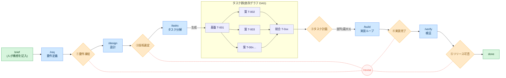

# Loose Rein

[English](README.md) | **日本語**

**Human on the Loop** で開発を進めるための、コーディングエージェント用ハーネス。
要件定義からテストまで、作業も成果物の作成も自己テストもエージェントが担当する。
**人間は各フェーズの境界にある「ゲート」で承認・判断するだけでよい。**

ハーネスの本体は**インストールして使う CLI**(`rein`)。プロダクトのリポジトリ側に残るのは
*状態*だけ — `.rein/`(SSOT〈信頼できる唯一の情報源〉・lock・実体化された prompts/schema)と
`docs/`(フェーズ成果物)の2つ。

**Claude Code** と **VS Code GitHub Copilot** はフックによるゲート強制まで含めてフル対応
(Copilot のフック機構は VS Code の preview 機能)。
**Codex** など `AGENTS.md` を読むエージェントも、規約と手順のレベルで動く(ゲートは慣習で維持)。
詳しくは「エージェント対応」の節を参照。

## 全体の流れ



- 🟦 エージェントが実行するフェーズ
- 🟧 ゲート①〜⑤ — **人間だけ**が開ける
- 🟩 人間の関与ポイント
- 🟪 タスク — DAG: 基盤 → 並列の葉 → 統合

フローは左から右へ進み、**前提のゲートが未承認のうちは次のフェーズへ進めない**。`/build` は
タスク群を最大3並列で消化する。赤い点線は `/revise` による上流への差し戻しで、戻し先以降の
ゲートを連鎖的に `pending` へ戻す — これも人間の判断でのみ行う。

## どこから始めるか

最初に一度だけ CLI をインストールする(「セットアップ」参照)。その後は状況に応じて:

| いまの状況 | 入口 |
|---|---|
| ゼロから新しいプロダクトを作る(greenfield) | 「セットアップ」→「使い方」 |
| 開発中の既存リポジトリに導入する(brownfield) | 「セットアップ」(`rein init` が自動判定)→ `/onboard` |
| 導入済みのリポジトリで次の変更を始める | `docs/00-product-brief.md` に変更内容を書いて `/req`(前サイクルが未クローズなら先に `rein cycle-close --name <slug>`) |
| リリース判断(ゲート⑤)が済んだ | `rein cycle-close --name <slug>` — 今サイクルの docs をアーカイブし、次サイクルに向けてリセット |
| 実体化されたツール群を更新したい | `rein upgrade`(取り除くときは `rein uninstall --all`) |
| 現在地が分からない・中断から再開する | `/status`(次に打つコマンドも表示)か `rein ui`(ローカルのダッシュボード) |

人間が日常的に打つコマンドは、次の少数の動詞に絞ってある(それ以外はダッシュボードの
ボタンに相当する操作 — 一覧は `rein --help`):

```bash
rein start        # 初回: 対話ウィザードでセットアップ / 導入済みなら現在地と次の一手を表示
rein next         # 次に打つべきコマンドだけを表示(連携用に --json あり)
rein ui           # ローカルダッシュボード — ゲートの成果物を読み、その場で承認まで行える
rein agent codex  # ヘッドレスで使うエージェント CLI を切替(claude | codex | gemini | 任意コマンド)
rein project add  # ダッシュボードのプロジェクト切替対象にリポジトリを登録
```

`project add` で複数のリポジトリを登録すると、ダッシュボードのヘッダに**プロジェクト切替**
(ドロップダウン)が現れ、サーバを立て直さずにボードの対象を切り替えられる。`rein ui` は
起動元のリポジトリを常に自動登録する。単発なら `rein --repo <path> <verb>`(または
`REIN_ROOT=<path>`)で、ディレクトリを移動せずに個々のコマンドを別リポジトリに向けられる。

## 設計原則

- **Architecture** — `rein build` は決定論的な DAG スケジューラ。各フェーズは専用のロール
  エージェントとして実行する。
- **Context** — 真実は SSOT に置き、ロールエージェントは必要な分だけ読む。監査ログ
  `events.ndjson` はローテーションしない。詳細は `.rein/prompts/rules/gate-workflow.md` の
  「Context budget」参照。
- **Tools** — ロールエージェントへのツール付与は最小限・用途限定にし、品質ゲートにはリトライ
  上限を設ける。

## セットアップ

前提は POSIX 環境と、サンドボックス用のコンテナランタイム(docker/podman):

| 環境 | 状態 |
|---|---|
| Linux | 対応 |
| WSL | 対応 — Windows 機で動かす場合はこれ |
| macOS | 対応 |
| Windows native | **未検証。** 起動を拒否はしないが、保証がない: ファイルロックは `msvcrt` にフォールバックし、ディレクトリの `fsync` は省略され、並列ビルドが使うコントロールプレーンは Unix domain socket を前提にしている。WSL を使うこと。 |

フックが PATH 上で `rein` を見つけられるよう、まず CLI を
インストールする:

```bash
uv tool install 'git+https://github.com/komoroko/loose-rein-kit.git@vX.Y.Z'   # `rein` コマンドが入る
# vX.Y.Z は最新のリリースタグに差し替える: https://github.com/komoroko/loose-rein-kit/releases
```

実装フェーズ(`rein build`)には、**ヘッドレスで動くエージェント CLI** も要る。既定は
`claude -p`、`rein agent codex` で切り替えられる(そのロールの adapter を `.rein/config.yaml`
に設定する。`gemini` も使える)。用意できない場合 `rein build` は起動を拒否し、`rein doctor` が
それを指摘する。

次にリポジトリを初期化する。**greenfield**(新規)でも **brownfield**(既存)でもコマンドは同じで、
brownfield は自動判定される(詳細は「既存リポジトリへの導入」):

```bash
cd myrepo && git init            # 新規でも既存でも同じ

# 対話ウィザード(推奨。質問はプロダクト名〔フォルダ名が既定〕と brief の1行のみ。
# ブランチは build/<name>、取得元はインストール元から自動検出、ヘッドレス CLI は既定のまま
# ——いずれも後から変更できる〔下記参照〕)
rein start
# 非対話で行う場合(何度実行しても安全):
#   rein init --name <product> [--branch build/<product>] [--source git+https://github.com/komoroko/loose-rein-kit]

# 任意・開発環境ごと — 使うエージェントの入口を必要になったら追加する:
rein install claude         # .claude/ のラッパーを書き、settings.json をマージ
rein install copilot        # .github/ に prompt / agent / hook のラッパーを書く
rein install codex          # .agents/skills/ と .codex/ に agent / hook のラッパーを書く
```

エディタ／エージェントの統合は、多くの場合セッションやエディタの起動時にしかコマンド・プロンプトの
ファイルを読み込まないので、`rein install claude|copilot|codex` を実行したら**新しい**セッションを
開く(またはエディタを再起動する)こと——起動済みのセッションは途中で追加されたファイルを拾わない。
その新しいセッションで **`/req`** から始める(現在地と次の一手は常に `rein next` が示す——
「使い方」の節を参照)。

`rein init` が書き込むのは**状態だけ**:

- SSOT の4文書(`plan.yaml` / `state.yaml` / `review.yaml` / `config.yaml`、プレースホルダ入り)と、docs の
  スキャフォールド
- 実体化された `.rein/prompts`・`.rein/schema`・`.rein/AGENTS.rein.md`、
  初期スキャフォールドのスナップショット、`.rein/rein.lock`(ツールのバージョン・
  取得元と、導入ファイルごとの内容ハッシュ)
- `AGENTS.md` へのマーカー付きポインタブロックの追記
- 作業ブランチの作成と切り替え(実装は main ではなくこのブランチで行う)、ゲートガードの有効化

それ以外には触れない — ビルドファイルも makefile も書かず、エージェントの入口も
`rein install` するまでは入らない。brownfield の場合は `/onboard` への案内も添えられる。

実体化されたファイルを最新に保つには:

- `rein sync` — インストール済みパッケージから prompts/schema を再実体化する(手を入れて
  いないファイルは更新し、ローカルで変更したファイルは保持して一覧表示。`--force` で上書き、
  `--check` は書き込まずズレの報告だけ)
- `rein upgrade` — CHANGELOG の差分を表示したうえで、ツールが実体化したものをすべて更新する
- `uv tool upgrade loose-rein-kit` — CLI 本体そのものを更新する

### サンドボックスイメージ

リポジトリのコードとテストがホストではなくサンドボックスの中で走るまで `rein doctor` は
FAIL を報告する(エージェントが書いたテストファイルをあなたの資格情報つきで実行させないため)。
最初の `/build` の前に:

```bash
rein oci build --all --write-config # 3つの同梱イメージをビルドして pin する(docker/podman が必要)
rein oci verify                     # pin が揃っているか確認する
```

`rein init`・`rein next`・ダッシュボードは適切なタイミングでこれを促し、ウィザードはその場で
実行もできる。詳細(独自Containerfile・再pin・実行時フラグ)は `.rein/config.yaml` の
`SANDBOXES` コメントブロックに書いてある。

## 自分で設定するリポジトリ側の項目

Loose Rein はこれらを読んで診断するだけで、設定はしない。ブランチ保護・必須チェック・シークレットは
リポジトリ管理の領域で、自分を裁くチェックを自分で付け外しできるツールは境界にならない。
ホスティング側で一度だけ設定すること:

| 設定 | 理由 |
|---|---|
| `main` を保護する(直接 push 禁止・PR 必須) | ハーネスが守るゲート境界はすべて作業ブランチ上にある。直接 push はその全部を迂回する。 |
| 必須チェックに `tests` と `base-side policy check` を入れる | `policy-check` はプルリクエストが偽装できない唯一のチェック——信頼できるベース側から head ツリーを読む。必須にしなければ単なる参考値。 |
| 新しいコミットで古い承認を無効化する | 承認の対象は差分で、ブランチ名ではない。 |
| `.rein/` や `.github/workflows/` を変更する PR の自己承認を禁じる | そこが境界そのもの。 |
| CI でシークレットスキャン(gitleaks) | コミット段階のフックは、それを入れた開発者しか守らない。 |

ローカルから見える部分だけは `rein doctor` が報告する——ワークフローが `rein policy-check` を
実行しているかどうか(していなければ WARN)。残りはリポジトリ管理者の責務。なお `policy-check` を
導入するコミット自体は自己検証されない(それを検査すべき、より古いベース側の検証器が存在しない
ため)。

## 既存リポジトリへの導入(brownfield)

専用の導入コマンドはない — `rein init` が唯一の入口で、既存のコードベース(`src/`・
`package.json`・`pyproject.toml` など)を**自動判定**する。判定されると:

- `config.yaml` の `guard.paths` を docs 成果物だけに絞り、ゲートが未承認でも既存コードの開発が
  止まらないようにする(準備ができたら `src/: tasks` のようにコードのパスを戻す)。
- 品質ゲートの test/check コマンドを、認識できる範囲でプロジェクトのツールから埋める
  (`--test-cmd` / `--check-cmd` で上書き可能)。
- `docs/00-product-brief.md` に `/onboard` を案内する導入メモを付ける。

既存ファイルは**決して上書きしない**(再実行しても安全)。導入後の流れは:

1. **`/onboard`** — 既存コードベースを読み取り専用で調査し、**恒久ベースライン**
   `docs/05-current-state.md` を作る。既存の挙動を要件や完了済みタスクへ逆生成することは
   **しない** — ゲートを開くのは常に人間で、トレーサビリティ(R-N)は各サイクルの差分だけに
   適用される。作りかけの実装がある場合は、先頭に**吸収タスク**を置き、既存の部分実装を
   テストで green に固定してから新しい作業を積む。
2. **デルタサイクル** — `brief → /req → … → /verify` の1周で**1つの変更**を扱い、
   `rein cycle-close` で締める(進め方は「使い方」と同じ)。`docs/00-product-brief.md` と
   `docs/05-current-state.md` はサイクルをまたいで残る。
3. **いつでも撤去できる** — `rein uninstall claude|copilot|codex` はエージェントの入口を取り除き
   (手を入れていないファイルのみ。settings のマージはエントリ単位で戻す)、
   `rein uninstall --all` は実体化された成果物と lock をすべて削除する。リポジトリ自身の
   状態(SSOT と `docs/`)には触れない。

## 使い方

1. `docs/00-product-brief.md` に「何を作りたいか」を数行で書く(人間が書く出発点はこれだけ)。
2. 次のコマンドを順に実行する。各コマンドは最後に承認を求めて止まる。

   | 手順 | コマンド | 何が起きるか | あなた(人間)の役割 |
   |------|----------|--------------|--------------------|
   | 要件 | `/req`    | 対話で要件を構造化する | ① 要件を凍結する |
   | 設計 | `/design` | 実装方針と技術選定の選択肢を提示する | ② 技術選定を決めて承認する |
   | 分解 | `/tasks`  | テスト方針付きのタスク票を生成する | ③ タスク計画を承認する |
   | 実装 | `/build`  | ループで自律実装する(テスト green が完了条件) | ④ 実装をレビューして承認する |
   | 検証 | `/verify` | 機能テストと非機能テストを実行する | ⑤ リリース可否を判断する |

3. **ゲートを開く**: これは人間の行為であってエージェントの行為ではなく、開く場所は2つある。
   どちらも先に readiness を確認し、承認が束縛する digest を表示し、同じ唯一の記録経路に至る。
   receipt にはどちらのチャネルで確認されたかが残る:

   ```bash
   rein approve build            # readiness を確認したのち:
   #   gate 'build' is ready. This approval will cover:
   #     plan_digest          sha256:…
   #     attested_chain_root  sha256:…
   #   Approve gate 'build'? [y/N] y
   #   gate 'build' opened (GA-BUILD-a1b2c3d4)
   ```

   あるいは `rein ui` で、成果物を読んだその画面のまま承認する — 追加の手数はない。

   **承認は、事故でも、既定動作でも、誰かが事前承認した設定によっても起こらない**: `rein
   approve` は対話的 TTY を要求する(パイプされた stdin・CI ジョブ・エージェントのサブプロセス
   はいずれも通らない)、ダッシュボードは `rein ui` を起動した端末にしか印字されない単回使用の
   起動リンクを使う、`rein doctor` は設定ファイルがゲートを開ける動詞を事前承認していないか
   検査する。`--force` は存在せず、ゲート行の手編集はガードが拒否する。

4. **修正を求める**: 成果物が正しくないときは、こちらが一級の答えになる — 行き止まりではない。
   プロンプトで no と答えるか、ダッシュボードの *Request changes* を使う:

   ```bash
   rein changes add requirements --target docs/10-requirements.md#R-3 \
                                 --reason "受入基準が計測不能"
   ```

   open な要求は**ゲートを閉じたまま保つ**。`state.yaml` に載るので、上げたセッションが終わっても
   消えない。`--target` の錨により、エージェントは指す断片だけを読んで直す(文書全体のやり直し
   にはならない)。応答は `rein changes address <id> --note <何を変えたか>` で、これがゲートの
   閉塞を解き、そのノートを承認画面に載せる。

5. **差し戻す**: ゲートを承認した**あとで**上流(要件・設計)の不備が見つかったら
   `/revise <phase>` を実行する。戻し先以降のゲートが連鎖的に `pending` へ戻る。`rein revise
   --impacted T-00x` は、指定した起点タスクとその下流をまとめて `needs-revision` にする(自動で
   波及することはない)。基盤タスクを起点に指定すると下流のほぼ全体が対象になるので、起点は
   狭く選ぶこと。
6. **進捗を確認する**:
   - `rein next` — 次に打つべきコマンドだけを表示する(連携用に `--json`)
   - `rein status` — 冒頭に **Waiting on you** を出す。リポジトリと次のゲートの間に立って
     いるものを重い順に並べ、それぞれの重要度と、それを片付けるコマンドを示す。blocking の行は
     `rein approve <gate> --check` が拒否する理由そのものなので、開かないゲートについて
     ボードが「対応不要」と言うことは起こらない
   - `/status` — 同じボードをチャットで示す(タスク DAG も併せて)
   - `rein ui` — ダッシュボードを開く。Overview ボードはこのキューを表示し、**Review タブ**では
     承認待ちゲートの成果物を1画面で読み承認できる(scope → 何が変わりどうレビューされたか →
     この変更が人に何を要求するか → 未決着の claim・gap・finding を1件1カードで示す Decision
     Card。high/critical のカードが未回答なら freeze はできない)。ほかに Tasks タブ(DAG・
     レイヤー進行)、Activity タブ(イベントのライブフィード)がある。ゲートやエスカレーション
     待ちはオプトインのベル通知で知らせる。操作は固定ホワイトリスト — 読み取り・診断・意思決定
     の記録(approve / resolve / revise / cycle-close)のみで、フェーズ実行や push/PR/merge は
     ここでは行えない
   - `rein dag --mermaid` — タスクの依存図を生成する
7. **PR にする**: `rein pr-draft` が SSOT から PR 本文を組み立てて `.rein/pr-draft.md`
   に書き出す(読み取り専用)。PR の作成や push は従来どおり人間の操作。
8. **サイクルを閉じる**: ゲート⑤のあと `rein cycle-close --name <slug>` を実行すると、docs が
   `docs/archive/<日付>-<slug>/` へアーカイブされ、新しいスキャフォールドが復元され、ゲートと
   フェーズがリセットされる。ゲートを開くのと同じく、これも人間の操作。

### 実装フェーズを自律で回す

正式な手順は `.rein/prompts/commands/build.md` と `AGENTS.md`。

**`rein build`** が、どのタスクを・何並列で・どの順にマージし・いつ止めるかを、
`config.yaml`・`plan.yaml`・`state.yaml` から決定論的に決める。LLM の裁量には依存しない
(`--dry-run` を付けると、エージェント CLI や git を呼ばずに制御フローだけ確認できる)。
手で同じことをする経路は無い — `state.yaml` は機械が書くもので(`rein guard` が手編集を拒否する)、
葉タスクの判断が監査チェーンに届く経路はオーケストレータが立てる control plane だけだからである。

ルール:

- タスクは `config.yaml` の `quality_gate` — **DoD の唯一の定義**(既定: `test` → `check` →
  `/code-review` + `/simplify` による review ステップ → 起動できる成果物なら実起動の smoke
  テスト。起動できるようになったら smoke ステップに `required: true` を設定する)— を通過して
  はじめて完了になる。各ステップにはリトライ予算があり、使い切ると `blocked` になる。ステップは
  `paths:` で自分のスコープを絞れるので、複数スタックが混在するリポジトリで無関係な分まで毎回
  払わずに済む(gate ③ で凍結される config 側の判断)。
- **並列の葉タスクは** `git worktree` で隔離実行し(最大 `max_parallel`)、タスク id の昇順で
  マージする。解決できないタスクは `blocked`、上流の不備は `needs-revision` としてエスカレー
  ションし、ループは停止する。ゲートを開けるのは人間だけで、オーケストレータは `gates.build` に
  触れない。

### 無人での再実行

`rein build` の終了コードが次に何をすべきかを示す: `0` は全タスク完了(ゲート④へ)、`1`/`2` は
人間の対応が要る(エスカレーションを読む、または指摘箇所を直す)。`3` は容量切れ・シグナル・他の
run のロック保持といった時間が解決する失敗で、何も印を付けず予算も消費していないので、そのまま
再試行してよい。`rein build --supervise` は `3` を自動で再試行する
(`--supervise-interval-sec`、既定 900)。各停止の見分け方と対処は「トラブルシューティング」を
参照。

> **DoD のコマンドはプロジェクト固有**: `quality_gate` に一度だけ書く。同梱の既定値
> `make test` / `make check` はプレースホルダで、brownfield では `rein init` が検出した
> コマンドを埋める。それ以外の場合は自分のプロジェクトのコマンドに置き換えること。

### セキュリティ検査

3つの層で担保する:

- コミット段 — **gitleaks** がシークレットのコミットを防ぐ(誤検知は `.gitleaksignore` へ)
- 実装完了時 — **構造化セキュリティレビュー**がゲート④の grounded review に組み込まれる。
  `rein review generate` がレビュー対象 HEAD に束ねて実行し、blocking な指摘はゲートを止める
- `/verify` — **セキュリティレビューと依存パッケージの脆弱性監査**が必須

指摘は散文ではなく構造化(severity・code anchor・blocking フラグ)され、後続コミットは再生成まで review を stale にする。

### GitHub Issues 連携(任意)

**既定はオフ**。`github.enabled: true` で有効化する(`gh` CLI と GitHub remote が前提。なければ
自動でスキップ)。`rein issue-sync` は plan のタスクを Issues へ**一方向にミラー**する —
タスク T-NNN と Issue が1対1で対応し、不可視マーカー `<!-- rein:T-NNN -->` で突き合わせ、
`kind:*` / `status:*` / `risk:*` / `claim:*` ラベル(自動作成)を付ける。Issues 側で編集しても
読み戻さない(SSOT は常に `plan.yaml` + `state.yaml`)。Issue への書き込みは外向きの操作なので、オプトインが
そのまま同意の表明になる。

## トラブルシューティング

- **まずは `rein doctor`** — 環境と SSOT を読み取り専用で一括診断する(PATH 上のバイナリ、
  config/state/tasks の整合性、ゲート連鎖の不変条件、フック登録、worktree の残骸、未解決の
  エスカレーション、review の鮮度、sandbox の digest 固定、lock の健全性、schema 検証)。以下の症状の
  多くはここに FAIL / WARN として現れる。
- **タスクが `blocked` になった** — リトライ予算内で品質ゲートを通せなかったということ。
  `rein events --render` でエスカレーションの内容を読み、原因(またはタスク票)を直したうえで、
  **`rein task reset T-NNN --reason "…"`** でフロンティアに戻してから `rein build` を再実行する。
  (`state.yaml` を直接編集するのではない。あれは Central Store のトランザクション内でのみ書かれ、
  手編集は `rein guard` が拒否する。この動詞がそのトランザクションそのもので、変更の隣に理由が
  記録される。handoff は既定で保持するのでリトライ予算が黙って満タンに戻ることはない——
  `--fresh` を付けると破棄し、その事実も記録される。)
  エスカレーションはログに残り続ける——追記専用で `resolve` に相当する動詞は無く、
  結論は `/verify` の回顧に書く。上流の不備が原因なら、代わりに `/revise <phase>`。
- **run が止まったが、どこにも異常が見当たらない** — blocked のタスクも、エスカレーションも無く、
  ボードは以前のまま。それはタスクではなく機械側の失敗——エージェントの容量制限、プロセスの強制終了、
  CLI の不在など。`rein doctor` と `rein resume` がその事実を示す。終了コードが `3` だったなら、
  容量が戻ってから `rein build` を再実行するだけでよい。各タスクは status もリトライ予算も
  保持したままで、退避された作業も自動的に拾われる。
- **ループが中断した**(Ctrl-C・クラッシュ)— 別のターミナルからでも、そのまま `rein build` を
  再実行すればよい。起動時に `in-progress` のタスクを `todo` に戻し、残った worktree も掃除される。
  中断した葉タスクのコミットは salvage ブランチに退避したうえで次の試行の worktree にマージし直し
  (コンフリクトしたときは強制せず、その旨を記録する)、落ちたステップ・その出力・実際に残っている
  リトライ予算は `state.yaml.tasks.<id>.handoff` が引き継ぐ。つまり再実行は、やり直しではなく続きから。
- **ゲートガードに編集を拒否された** — 前提のゲートが `pending` のまま、次フェーズの成果物を
  編集しようとしている(つまり仕組みが正しく働いている)。ゲートの承認を得るか、`/revise` で
  巻き戻すこと。回避手段は存在しない——`gates.enforce_hook` のような迂回キーは受け付けず、
  持ち込もうとしたプルリクエストは CI のベース側 `policy-check` が落とす。
- **「template placeholders」と言われて起動を拒否される** — 先に `rein start`(または
  `rein init --name <product>`)を実行する。
- **フック実行時に `rein: command not found`** — CLI を PATH に入れる(「セットアップ」参照)。
  フックのバイナリが見つからない状態は `rein doctor` でも FAIL になる。
- **`/req` などのフェーズコマンドが使っているエージェントに出てこない** — エージェントの入口は
  任意で、`rein start`/`init` が自動で用意するわけではない。使っているエージェントに合わせて
  `rein install claude`(`.claude/commands/` を書き、`.claude/settings.json` をマージ)や
  `rein install copilot`(`.github/` 側のラッパーを書く)、`rein install codex`
  (`.agents/skills/` と `.codex/` 側のラッパーを書く)を実行すること。これらは多くの場合
  セッションやエディタの起動時にしか読み込まれないので、実行後は**新しい**セッションを開く(または
  エディタを再起動する)こと——起動済みのセッションは途中で追加されたファイルを拾わない。

## リポジトリ構成

| パス | 役割 |
|------|------|
| `.rein/plan.yaml` | 凍結された Expected Model: 要件1件ごとの claim・タスク DAG |
| `.rein/state.yaml` | 可変な状態: フェーズ・ゲート承認・タスク状態 |
| `.rein/review.yaml` | マシンレビューとヒューマンレビュー(それぞれ独立に digest 化) |
| `.rein/events.ndjson` | ハッシュ連鎖された監査ログ — あらゆる状態変更の機械可読な真実(`rein events` で操作。最初のイベント発生時に作られる) |
| `.rein/config.yaml` | 確定実行の設定と、DoD の唯一の定義(`quality_gate`) |
| `.rein/rein.lock` | 文書フォーマット、ツールのバージョン・取得元、導入ファイルごとの内容ハッシュ |
| `.rein/schema/` | SSOT 各文書の JSON Schema(エディタでの検証と `rein doctor` が使う)— 実体化ファイル |
| `.rein/prompts/` | 全エージェントが読む共有のフェーズ手順・ロール定義・フェーズ限定ルールモジュール(`rules/`)— 実体化ファイル |
| `.rein/AGENTS.rein.md` | エージェントの入口が import する運用規約の本体 — 実体化ファイル |
| `AGENTS.md` / `CLAUDE.md` | エージェント中立な運用規約の正本 / Claude Code 向けの能力対応表(Claude Code が読むのは CLAUDE.md であり AGENTS.md ではない。`@AGENTS.md` インポートで規約を一度だけ読み込む。`rein install claude` が対応表ブロックと `.claude/` ラッパーを製品リポに書き込む) |
| `.claude/`・`.github/` | エージェント別の入口・ロールのラッパー・ゲートガードのフック登録(`rein install` で任意導入) |
| `docs/` | フェーズ成果物(要件・設計・ADR・タスク票・テスト計画) |

オーケストレーションのコード自体はインストールされた `rein` パッケージの中にあり、
リポジトリには置かれない。

## エージェント対応

規約(`AGENTS.md`)と手順(`.rein/prompts/`)はエージェント中立に書かれており、人間との
やり取りが必要な箇所を**能力ボキャブラリ**という共通の語彙で表す。それを各エージェントでどう
実現するかは、エージェントごとの対応表ファイルが定める。

| 能力 | Claude Code | VS Code Copilot | Codex |
|---|---|---|---|
| フェーズの入口 | スラッシュコマンド(`.claude/commands/`) | prompt files(`.github/prompts/`) | skills `$req` …(`.agents/skills/`) |
| ゲート強制 | PreToolUse フック + コミット段のチェック | 同じフックを agent hooks(preview)で + コミット段のチェック | 同じフックを `apply_patch` に(`.codex/hooks.json`)+ コミット段のチェック |
| 人間への構造化質問 | AskUserQuestion | チャットで番号付きの選択肢 | チャットで番号付きの選択肢 |
| 承認の提示 | plan mode + ExitPlanMode | Plan モード / 明示的な「approve」 | 明示的な「approve」 |
| ロール委譲 | subagents | custom agents `@architect` など | subagents(`.codex/agents/*.toml`、明示委譲) |
| 自律ビルド | `rein build` | `rein build` | `rein build` |
| ゲート待ちの通知 | PushNotification | ターン終了時に明示 | ターン終了時に明示 |

対応表を持たないエージェント(AGENTS.md だけを読むもの)は、`AGENTS.md` の能力ボキャブラリ表に
ある劣化列に従う。

- エージェントの入口はオプトインで、`rein install claude|copilot|codex` が書き込む。これらは
  インストール済みの `rein` CLI を呼び出すため、フックの前提として `uv tool install` が
  必要になる。
- Codex 側は **実機で未検証**。フックのペイロード形・skills と subagents の探索パスは、
  openai/codex のソースと公式ドキュメントから確定させたもので、実際の Codex セッションで観測した
  ものではない。また Codex の project スコープ設定は**プロジェクトを信頼するまで読まれない**ため、
  それまではコミット段のチェックだけが効く。
- どのホストでも、**シェル経由の書き込み**(`sed -i`、ヒアドキュメントのパッチ)は編集時フックの
  matcher に掛からない。コミット段の `rein guard --check-diff` がそれを拾う。
- VS Code Copilot の agent hooks は **preview** 機能で、無効な場合でもゲートは慣習のレイヤーで
  維持される。
- 並列の葉タスクは、委譲が使えない環境では直列に劣化する。どのフックホストが登録済みかは
  `rein doctor` が報告する。
