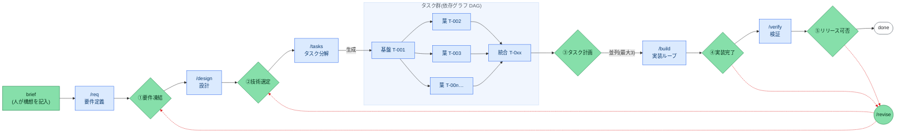

# Loose Rein

[English](README.md) | **日本語**

**Human on the Loop** で開発を進めるための、コーディングエージェント用ハーネスである。
要件定義から検証まで、実装も成果物の作成も自己テストもエージェントが担当するため、人間の作業は
**フェーズの境界に置かれた「ゲート」での承認と判断に限定される。**

ハーネス本体はインストールして使う CLI(`rein`)であり、プロダクトのリポジトリに残るのは*状態*
のみである。SSOT〈信頼できる唯一の情報源〉と lock、実体化した prompts/schema を格納する
`.rein/` と、フェーズ成果物を格納する `docs/` の2つに限られる。

## 全体の流れ



- **緑** — 人間が判断する箇所。brief、ゲート①〜⑤、`/revise` の3つが該当する。
- **青** — エージェントが実行する箇所。各フェーズと、そこで処理されるタスク群を指す。
- **赤い点線の矢印** — 差し戻しを表す。下流のゲートから上流のゲートへ向かう。

流れは左から右へ進む。**前提のゲートが未承認のあいだは、次のフェーズに進めない。** `/build` は
タスク群を最大3並列で処理する。`/revise` は戻し先から下流のゲートを連鎖的に `pending` へ戻す
操作であり、これも人間が決めたときにのみ実行される。

各フェーズはコマンド1つに対応し、いずれも最後に承認を求めて停止する:

| 手順 | コマンド | 何が起きるか | 人間の役割 |
|------|----------|--------------|------------|
| 要件 | `/req`    | 対話で要件を構造化する | ① 要件を凍結する |
| 設計 | `/design` | 実装方針と技術選定の選択肢を出す | ② 技術選定を決めて承認する |
| 分解 | `/tasks`  | テスト方針付きのタスク票を生成する | ③ タスク計画を承認する |
| 実装 | `/build`  | ループで自律実装する(テスト green が完了条件) | ④ 実装をレビューして承認する |
| 検証 | `/verify` | 機能テストと非機能テストを実行する | ⑤ リリース可否を判断する |

## セットアップ

次の6手順を順に実行する。進捗は `rein doctor` がいつでも点検できるので、green になった時点で
新しいセッションを開き、`/req` から始めればよい。

**1. 前提** — POSIX 環境と、サンドボックス用のコンテナランタイム(docker/podman)が必要になる:

| 環境 | 状態 |
|---|---|
| Linux | 対応 |
| WSL | 対応 — Windows 機で動かすならこれ |
| macOS | 対応 |
| Windows native | **未検証。** 起動を拒否こそしないが、保証はない: ファイルロックは `msvcrt` にフォールバックし、ディレクトリの `fsync` は省かれ、並列ビルドが使うコントロールプレーンは Unix domain socket を前提にしている。WSL の利用を推奨する。 |

**2. CLI を導入する** — フックが PATH 上の `rein` を解決できるようにする:

```bash
uv tool install 'git+https://github.com/komoroko/loose-rein-kit.git@vX.Y.Z'   # `rein` コマンドが入る
# vX.Y.Z は最新のリリースタグに差し替える: https://github.com/komoroko/loose-rein-kit/releases
```

**3. ヘッドレスのエージェント CLI を用意する** — 実装フェーズ(`rein build`)が呼び出す対象を
指定する。既定は `claude -p` で、`rein agent codex` により切り替えられる(`gemini` も指定できる)。
用意がない場合、`rein build` は起動しない。

**4. リポジトリを初期化する** — 新規・既存のどちらでも同じコマンドを使う。既存かどうかは自動で
判定され、その結果に応じて `init` が書き込む内容が変わる(「既存リポジトリへの導入」):

```bash
cd myrepo && git init

rein start   # 対話ウィザード。入力を求められるのはプロダクト名と brief の1行のみ
# 非対話で行う場合(何度実行しても安全):
#   rein init --name <product> [--branch build/<product>] [--source git+https://github.com/komoroko/loose-rein-kit]
```

**5. エージェント連携ファイルを配置する** — 任意。必要になった時点で追加すればよい:

```bash
rein install claude         # .claude/ のラッパーを書き、settings.json をマージ
rein install copilot        # .github/ に prompt / agent / hook のラッパーを書く
rein install codex          # .agents/skills/ と .codex/ に agent / hook のラッパーを書く
```

これらのファイルはセッションやエディタの起動時にのみ読み込まれることが多い。実行後は**新しい**
セッションを開く(エディタの場合は再起動する)。

**6. サンドボックスイメージをビルドする** — リポジトリのコードとテストは、ホストではなく
サンドボックス内で実行する。エージェントが書いたテストを利用者の資格情報つきで実行させないための
境界である。pin が完了するまで `rein doctor` は FAIL を報告し続ける:

```bash
rein oci build --all --write-config # 3つの同梱イメージをビルドして pin する(docker/podman が必要)
rein oci verify                     # pin が揃っているか確認する
```

`rein init` とウィザードは適切なタイミングでこれを促し、その場で実行することもできる。独自
Containerfile・再 pin・実行時フラグの詳細は、`.rein/config.yaml` の
`SANDBOXES` コメントブロックに記載してある。

## 使い方

人間が日常的に実行するコマンドは、次のものに限られる。それ以外はダッシュボードのボタンに相当
する操作であり、一覧は `rein --help` で確認できる。

```bash
rein start        # 初回: 対話ウィザードでセットアップ / 導入済みなら現在地と次のコマンドを表示
rein next         # 次に実行すべきコマンドだけを表示(連携用に --json あり)
rein ui           # ローカルダッシュボード。ゲートの成果物を読み、その場で承認できる
rein agent codex  # ヘッドレスで使うエージェント CLI を切替(claude | codex | gemini | 任意コマンド)
rein project add  # ダッシュボードのプロジェクト切替対象にリポジトリを登録
```

`project add` で複数のリポジトリを登録すると、ダッシュボードのヘッダに**プロジェクト切替**の
ドロップダウンが表示され、サーバを再起動せずに対象を切り替えられる。`rein ui` は起動元の
リポジトリを自動で登録する。単発の操作であれば、`rein --repo <path> <verb>`(または
`REIN_ROOT=<path>`)でディレクトリを移動せずに別のリポジトリを対象にできる。

1サイクルは、次の手順で進む。

1. **brief を書く** — `docs/00-product-brief.md` に「何を作りたいか」を数行で記述する。人間が
   書く出発点はこれだけである。

2. **フェーズを順に実行する** — 上の表の順序でフェーズコマンドを実行する。次のコマンドは
   `rein next` が示す。`/status` は同じ内容を、タスク DAG とともにチャットへ出力する。

3. **ゲートを開く** — これは人間の行為であって、エージェントの行為ではない。手段は2つあり、
   いずれも事前に承認可能かを確認し、その承認が対象とする digest を表示したうえで、同一の記録
   経路に到達する。receipt には、どちらの手段で確認したかが記録される:

   ```bash
   rein approve build            # readiness を確認したのち:
   #   gate 'build' is ready. This approval will cover:
   #     plan_digest          sha256:…
   #     attested_chain_root  sha256:…
   #   Approve gate 'build'? [y/N] y
   #   gate 'build' opened (GA-BUILD-a1b2c3d4)
   ```

   もう1つは `rein ui` で、成果物を読んだ画面のまま承認できる。この2つに人間以外が到達できない
   仕組みは、「ゲートを開く権限」に記載した。

4. **修正を求める** — 成果物が適切でない場合、これは正規の選択肢であり、対応の打ち切りを意味
   しない。プロンプトで no と答えるか、ダッシュボードの *Request changes* を使う:

   ```bash
   rein changes add requirements --target docs/10-requirements.md#R-3 \
                                 --reason "受入基準が計測不能"
   ```

   未対応の要求がある間、**ゲートは閉じたままになる**。要求は `state.yaml` に記録されるため、
   それを登録したセッションが終了しても失われない。`--target` で箇所を指定すると、エージェントは
   その部分だけを読んで修正するので、文書全体の再生成にはならない。応答は
   `rein changes address <id> --note <何を変えたか>` で行い、これによりゲートの閉塞が解除され、
   ノートが承認画面に表示される。

5. **差し戻す** — ゲートを承認した**あとで**上流(要件・設計)の不備が見つかった場合は
   `/revise <phase>` を実行する。戻し先から下流のゲートが連鎖的に `pending` へ戻る。
   `rein revise --impacted T-00x` は、指定した起点タスクとその下流をまとめて `needs-revision` に
   する。自動で波及することはない。起点に基盤タスクを指定すると下流のほぼ全体が対象に含まれる
   ため、起点は狭く選ぶとよい。

6. **進捗を確認する** — 手段は次のとおりである。

   - `rein next` — 次に実行すべきコマンドだけを表示する(連携用に `--json`)
   - `rein status` — 冒頭に **Waiting on you** を表示する。リポジトリと次のゲートの間にある課題を
     重大な順に並べ、それぞれの深刻度と、解消するためのコマンドを示す。blocking の行は
     `rein approve <gate> --check` が拒否する理由そのものなので、開かないゲートについてボードが
     「対応不要」と表示することはない
   - `/status` — 同じ内容をチャットに表示する(タスク DAG も併せて)
   - `rein ui` — ダッシュボードを開く。Overview ボードはこのキューを表示する。**Review タブ**では、
     承認待ちゲートの成果物を1画面で読み、そのまま承認できる(scope → 何が変わりどうレビュー
     されたか → この変更が人に何を要求するか → 未決着の claim・gap・finding を1件1枚で示す
     Decision Card。high/critical のカードが未回答のうちは freeze できない)。ほかに Tasks タブ
     (DAG・レイヤー進行)と Activity タブ(イベントのライブフィード)がある。ゲートや
     エスカレーションの待機は、オプトインのベル通知で知らせる。操作は固定ホワイトリストに
     限られ、読み取り・診断・意思決定の記録(approve / resolve / revise / cycle-close)のみで、
     フェーズ実行や push/PR/merge は行えない
   - `rein dag --mermaid` — タスクの依存図を生成する

7. **PR にする** — `rein pr-draft` が SSOT から PR 本文を組み立て、`.rein/pr-draft.md` に出力する
   (読み取り専用)。PR の作成と push は人間が行う。

   1 タスク 1 PR の**スタック**として出すこともできる。`rein pr-stack` は、各タスクが着地した
   コミットで作業ブランチを切り分け、スライスごとにブランチを張り、本文を 1 枚ずつ書く。
   `--push` は端末で確認を取ってから **draft として** PR を開き、`--ready` はゲート④の承認後に
   draft を外す。レビュー指摘の修正は、そのコードを入れたスライスにコミットし、`--restack` が
   マージで上へ伝播させる。**スタックを rebase してはならない** — 履歴を書き換えると、
   `completed_commit` とゲート受領証が指すコミットが消えるためである。マージは下から順に
   `gh pr merge --merge --delete-branch` で行う。squash や rebase では本文が別コミットとして
   base に入り、上位の PR すべてに同じ差分が再び現れる。

8. **サイクルを閉じる** — ゲート⑤のあと `rein cycle-close --name <slug>` を実行すると、docs が
   `docs/archive/<日付>-<slug>/` へアーカイブされ、新しいスキャフォールドが復元され、ゲートと
   フェーズがリセットされる。ゲートを開くのと同様、これも人間の操作である。

実体化されたファイルを最新に保つ手段は、次の3つである。

- `rein sync` — インストール済みパッケージから prompts/schema を再実体化する。未変更のファイルは
  更新し、ローカルで変更したファイルは保持して一覧に表示する(`--force` で上書き、`--check` は
  書き込まずに差分を報告するのみ)
- `rein upgrade` — CHANGELOG の差分を表示したうえで、ツールが実体化したものをすべて更新する
- `uv tool upgrade loose-rein-kit` — CLI 本体を更新する

## ゲートを開く権限

`.rein/state.yaml` の `gates.<name>` が `approved` になる経路は1つだけで、`rein` が記録した
人間の承認に限られる。実作業をエージェントが担当していてもこれが成立し続けるのは、次の仕組みに
よる。

- **記録経路は1本、使用する手段は2つ。** 自分の端末で実行する `rein approve <gate>` と、
  ダッシュボードの承認フッターである。いずれも事前に承認可能かを確認したうえで、その承認が対象と
  する digest を表示する。receipt にはその digest と、どちらの手段で確認したかが記録される。誰が
  承認したかは記録しない。
- **事故・既定動作・事前承認された設定のいずれによっても開かない。** `rein approve` は対話的な
  TTY を要求する(パイプされた stdin、CI ジョブ、エージェントのサブプロセスはいずれも該当しない)。
  ダッシュボードは、`rein ui` を起動した端末にのみ出力される使い捨ての起動リンクを使う。
  `rein doctor` は、設定ファイルがゲートを開くコマンドを事前承認していないかを、gitignore された
  ローカル設定まで含めて検査する。`--force` は存在しない。
- **エージェントは3段階で遮断される。** 前提のゲートが `pending` のまま次フェーズの成果物を
  編集しようとすると、編集時に `rein guard` のフックが拒否する。シェル経由の書き込み
  (`sed -i`、ヒアドキュメントのパッチ)はこの matcher に該当しないが、コミット段の
  `rein guard --check-diff` が検出する。いずれかを弱めようとするプルリクエストは、CI のベース側
  `rein policy-check` が失敗させる。`gates.enforce_hook` のような迂回キーは受け付けず、ゲート行の
  手編集も拒否され、読み取れないゲートは閉じているものとして扱われる。
- **承認の巻き戻しも人間の権限である。** `/revise` は戻し先から下流のゲートを連鎖的に戻し、
  それを前提に記録された receipt と review を無効にする。上流が `pending` で下流が `approved` の
  まま残ることはなく、自動で巻き戻ることもない。

### 自分で設定する項目

Loose Rein はこれらを読み取って診断するだけで、自分では設定しない。ブランチ保護・必須チェック・
シークレットはリポジトリ管理の領分であり、自分を検査するチェックを自分で付け外しできるツールは
境界として機能しないためである。ホスティング側で一度だけ設定しておく:

| 設定 | 理由 |
|---|---|
| `main` を保護する(直接 push 禁止・PR 必須) | ハーネスが守るゲート境界は、すべて作業ブランチ上にある。直接 push はその全部を迂回する。 |
| 必須チェックに `tests` と `base-side policy check` を入れる | `policy-check` は、信頼できるベース側から head ツリーを読むため、プルリクエストが偽装できない唯一のチェックになる。必須に設定しなければ、参考情報にとどまる。 |
| 新しいコミットで古い承認を無効化する | 承認の対象は差分であって、ブランチ名ではない。 |
| `.rein/` や `.github/workflows/` を変更する PR の自己承認を禁じる | その2つが境界そのものであるため。 |
| CI でシークレットスキャン(gitleaks) | コミット段階のフックは、それを入れた開発者しか守らない。 |

ローカルから確認できる範囲は `rein doctor` が報告する。ワークフローが `rein policy-check` を
実行しているかを確認し、実行していなければ WARN を出す。残りはリポジトリ管理者の責務である。なお
`policy-check` を導入するコミット自体は検証されない。それを検査すべき、より古いベース側の検証器が
まだ存在しないためである。

## 証拠にもとづく判定

エージェントが自身の作業について述べる内容は、構造上つねに自己整合的になる。そのためゲートは、
それを判断材料にしない。判断の根拠になるのは次のものである:

- **証拠のない claim は `unknown` であり、散文で埋めない。** `.rein/plan.yaml` は要件
  (`R-N`/`NFR-N`)1件につき claim を1つ凍結する。これが **Expected Model** である。`claim_ids` が
  各タスクを、それが答える claim へ紐づけ、`rein dag --trace` が突き合わせる。
- **ゲート④は Expected と Actual を突き合わせる。** `rein review generate`(レビュー対象の HEAD に
  束ねて実行)が実行するのは、決定論的な Coverage Manifest、コードが実際に何をしているかの
  **ブラインド抽出**(この抽出器には計画を一切渡さない)、Expected と Actual の比較、そして
  構造化されたセキュリティ・保守性レビューである。読み取る対象はプロダクトであって `.rein/` では
  ない。
- **単一の `verified` は存在しない。** 指摘は integrity・semantic support・conformance という
  3つの独立した軸に分かれて出力される。「extra behaviours: 0」は、それを裏づけた Coverage
  Manifest がある場合にのみ表示される。blocking なセキュリティ指摘、high/critical な claim の
  乖離、根拠のない high/critical の追加挙動、不十分な manifest は、いずれもゲートを停止させる。
  後続コミットが入れば、再生成するまで review は stale になる。
- **`done` は、そのタスクが実際に生成したツリーに対して DoD が green になったことを意味する。**
  裏づけは status の隣に記録される内容フィンガープリントであり、実装者の申告ではない。何も変更
  しなかった試行はゲートに到達しない。変更のないツリー上の green は、もともと存在したコードに
  ついての事実でしかないためである。
- **判定する側は修正しない。** タスクごとのレビュアーは読み取り専用で起動して指摘を記録し、
  実装者がそれを解消し、レビュアーが再度確認する。実装者が最後に実行するのは
  `rein report --outcome implemented|blocked|needs-revision` であり、これは実際の diff と
  突き合わされる主張であって、判定ではない。
- **このループで取得できない証拠は、そう明示される。** 受入基準が `external`、すなわちステージング
  での確認・実機・人による確認であれば、作業はマージされ、タスクは `awaiting-evidence` で待機
  する。誰かが観測した内容を `rein evidence record` で記録して初めて先へ進む。その記録は対象の
  ツリーに紐づくため、コードが変われば失効する。
- **環境も pin する。** リポジトリのコードとテストは OCI サンドボックスで実行し、タグではなく
  digest で固定する。レビューを実行した環境が、そのレビューの承認後に変わることはない。
- **すべてはハッシュ連鎖のログに記録される。** `.rein/events.ndjson` はあらゆる状態変更とその
  理由を記録し、ゲートの receipt が連鎖のルートを固定する。行を削除・並べ替え・再ハッシュすれば、
  その receipt が依拠する連鎖が壊れる。

## 決定論的な実装ループ

正式な手順は `.rein/prompts/commands/build.md` と `AGENTS.md` に記載してある。

`rein build` は、どのタスクを・何並列で・どの順にマージし・いつ停止するかを、`config.yaml`・
`plan.yaml`・`state.yaml` から決定論的に決める。LLM の裁量には依存しない(`--dry-run` を付ければ、
エージェント CLI や git を呼ばずに制御フローだけ確認できる)。同じ処理を手作業で行う経路はない。
`state.yaml` は機械が書き込むもので、手編集は `rein guard` が拒否する。葉タスクの判断が監査
チェーンに到達する経路も、オーケストレータが構成する control plane に限られる。

ルールは次の2つである。

- タスクが完了になるのは、`config.yaml` の `quality_gate` を通過した場合のみである。これが
  **DoD の唯一の定義**であり、既定は `test` → `check` → `/code-review` + `/simplify` による
  review ステップ → 起動できる成果物であれば実起動の smoke テストとなる(起動できるようになった
  時点で、smoke ステップに `required: true` を設定する)。各ステップにはリトライ予算があり、
  使い切ると `blocked` になる。ステップは `paths:` でスコープを絞れるため、複数スタックが混在する
  リポジトリでも無関係な分まで毎回実行せずに済む(タスクごとに変えられる設定ではなく、gate ③ で
  凍結される config 側の判断である)。
- 並列の葉タスクは `git worktree` で隔離して実行し(最大 `max_parallel`)、タスク id の昇順で
  マージする。解決できないタスクは `blocked`、上流の不備は `needs-revision` としてエスカレーション
  し、ループは停止する。`gates.build` を開けるのは人間だけで、オーケストレータは操作しない。

### 無人での再実行

`rein build` の終了コードが、次に何をすべきかを示す。`0` は全タスクの完了(ゲート④へ進む)、
`1`/`2` は人間の対応が必要であること(エスカレーションを読むか、指摘箇所を修正する)を意味する。
`3` は容量切れ・シグナル・他の run がロックを保持中といった一時的な失敗で、タスクの状態を変更せず
予算も消費していないため、そのまま再試行してよい。`rein build --supervise` は `3` を自動で再試行
する(`--supervise-interval-sec`、既定 900)。各停止の判別方法と対処は「トラブルシューティング」を
参照。

> **DoD のコマンドはプロジェクト固有**: `quality_gate` に一度だけ書く。同梱の既定値
> (`python -m pytest`、`python -m compileall`)は、同梱の `python` サンドボックスイメージが
> 実際に実行できる最低限である。このイメージには python・uv・pytest しか入っておらず、
> ネットワークも無い。brownfield では `rein init` が検出したコマンドを埋める。それ以外の場合は
> 自分のプロジェクトのコマンドに置き換え、それが上記を超えるものを要求するなら
> `dockerfile:` でプロファイルを自前のイメージに向けること。

## セキュリティ検査

3つの層で担保する:

- コミット段 — **gitleaks** がシークレットのコミットを防ぐ(誤検知は `.gitleaksignore` へ)。
- 実装完了時 — **構造化セキュリティレビュー**がゲート④の grounded review に組み込まれる。
  `rein review generate` がレビュー対象 HEAD に束ねて実行し、blocking な指摘はゲートを停止させる。
- `/verify` — **セキュリティレビューと依存パッケージの脆弱性監査**が必須になる。

指摘は散文ではなく、構造化された形式(severity・code anchor・blocking フラグ)で出力される。
後続コミットが入ると、再生成するまで review は stale になる。

## 既存リポジトリへの導入(brownfield)

専用の導入コマンドはない。導入手段は `rein init` のみで、既存のコードベース(`src/`・
`package.json`・`pyproject.toml` など)を**自動判定**する。判定された場合の動作は次のとおり:

- `config.yaml` の `guard.paths` を docs 成果物だけに絞り、ゲートが未承認でも既存コードの開発が
  止まらないようにする(準備ができた時点で `src/: tasks` のようにコードのパスを戻す)。
- 品質ゲートの test/check コマンドを、認識できる範囲でプロジェクトのツールから補完する
  (`--test-cmd` / `--check-cmd` で上書きできる)。
- `docs/00-product-brief.md` に、`/onboard` を案内する導入メモを追加する。

既存ファイルは**上書きしない**(再実行しても安全である)。導入後の流れは次のとおり:

1. **`/onboard`** — 既存コードベースを読み取り専用で調査し、**恒久ベースライン**
   `docs/05-current-state.md` を作成する。既存の挙動を要件や完了済みタスクへ逆生成することは
   **しない**。ゲートを開くのは常に人間であり、トレーサビリティ(R-N)が及ぶのは各サイクルの
   差分だけだからである。作りかけの実装がある場合は、先頭に**吸収タスク**を置き、既存の部分実装を
   テストで green に固定してから新しい作業を積む。
2. **デルタサイクル** — `brief → /req → … → /verify` の1周で**1つの変更**を扱い、
   `rein cycle-close` で締める(進め方は「使い方」と同じ)。`docs/00-product-brief.md` と
   `docs/05-current-state.md` はサイクルをまたいで残る。
3. **いつでも撤去できる** — `rein uninstall claude|copilot|codex` はエージェント連携ファイルを
   削除する(対象は未変更のファイルのみで、settings のマージはエントリ単位で戻す)。
   `rein uninstall --all` は、実体化された成果物と lock をすべて削除する。リポジトリ自身の状態
   (SSOT と `docs/`)には触れない。

## GitHub Issues 連携(任意)

**既定はオフ**である。`github.enabled: true` で有効化する(`gh` CLI と GitHub remote が前提で、
なければ自動でスキップする)。`rein issue-sync` は plan のタスクを Issues へ**一方向にミラー**
する。タスク T-NNN と Issue が1対1で対応し、不可視マーカー `<!-- rein:T-NNN -->` で突き合わせ、
`kind:*` / `status:*` / `risk:*` / `claim:*` ラベル(自動作成)を付与する。Issues 側で編集しても
読み戻さない(SSOT は常に `plan.yaml` + `state.yaml` である)。Issue への書き込みは外向きの操作
であるため、オプトインすること自体が同意にあたる。

## トラブルシューティング

- **まずは `rein doctor`** — 環境と SSOT を読み取り専用で一括診断する(PATH 上のバイナリ、
  config/state/tasks の整合性、ゲート連鎖の不変条件、フック登録、worktree の残骸、未解決の
  エスカレーション、review の鮮度、sandbox の digest 固定、lock の健全性、schema 検証)。以下の
  症状の多くは、ここに FAIL / WARN として現れる。
- **タスクが `blocked` になった** — リトライ予算の範囲で品質ゲートを通過できなかった、という
  意味である。`rein events --render` でエスカレーションの内容を読み、原因(またはタスク票)を
  修正したうえで、**`rein task reset T-NNN --reason "…"`** で実行待ちの列に戻し、`rein build` を
  再実行する。`state.yaml` を直接編集してはならない。これは Central Store のトランザクション内で
  しか書き込まれず、手編集は `rein guard` が拒否する。このコマンドがそのトランザクションそのもの
  であり、変更の隣に理由が記録される。handoff は既定で保持されるため、リトライ予算が暗黙に上限
  まで回復することはない(`--fresh` を付けると破棄し、破棄した事実も記録される)。
  エスカレーションはログに残り続ける。追記専用で `resolve` にあたるコマンドはなく、結論は `/verify` の
  振り返りに記録する。原因が上流の不備であれば、代わりに `/revise <phase>` を使う。
- **run が停止したが、異常が見当たらない** — blocked のタスクもエスカレーションもなく、ボードも
  以前のままという状態である。これはタスクの失敗ではなく実行環境側の失敗で、エージェントの容量
  制限、プロセスの強制終了、CLI の不在などが原因になる。`rein doctor` と `rein resume` が原因を
  特定する。終了コードが `3` であれば、容量が回復してから `rein build` を再実行すればよい。各
  タスクは status もリトライ予算も保持しており、退避された作業も自動的に引き継がれる。
- **ループが中断した**(Ctrl-C・クラッシュ)— 別のターミナルからでも、そのまま `rein build` を
  再実行すればよい。起動時に `in-progress` のタスクを `todo` へ戻し、残った worktree も削除する。
  中断した葉タスクのコミットは salvage ブランチへ退避したうえで、次の試行の worktree にマージし
  直す(コンフリクトした場合は強制せず、その旨を記録する)。失敗したステップ・その出力・実際に
  残っているリトライ予算は `state.yaml.tasks.<id>.handoff` が引き継ぐ。したがって再実行は、
  やり直しではなく続きから始まる。
- **ゲートガードに編集を拒否された** — 前提のゲートが `pending` のまま、次フェーズの成果物を編集
  しようとしている状態で、仕組みが正しく働いていることを意味する。ゲートの承認を得るか、
  `/revise` で巻き戻す。回避手段は存在しない。`gates.enforce_hook` のような迂回キーは受け付けず、
  それを含むプルリクエストは CI のベース側 `policy-check` が失敗させる。
- **「template placeholders」と表示されて起動しない** — 先に `rein start`(または
  `rein init --name <product>`)を実行する。
- **フック実行時に `rein: command not found`** — CLI を PATH に配置する(「セットアップ」参照)。
  フックのバイナリが見つからない状態は、`rein doctor` でも FAIL になる。
- **`/req` などのフェーズコマンドが、使用しているエージェントに表示されない** — エージェント
  連携ファイルの配置は任意で、`rein start`/`init` が自動で行うわけではない。使用している
  エージェントに合わせて `rein install claude|copilot|codex` を実行し、新しいセッションを開く
  (「セットアップ」の手順5)。

## リポジトリ構成

`rein init` が書き込むのは**状態だけ**である。SSOT の4文書(プレースホルダ入り)、docs の
スキャフォールド、実体化された prompts/schema と初期スナップショット、`.rein/rein.lock`、
`AGENTS.md` へのマーカー付きポインタブロックを配置し、作業ブランチを作成して切り替え、
ゲートガードを有効にする。ビルドファイルや makefile は書き込まず、`rein install` を実行するまで
エージェント連携ファイルも配置されない。既存ファイルを上書きすることもない。

| パス | 役割 |
|------|------|
| `.rein/plan.yaml` | 凍結された Expected Model: 要件1件ごとの claim・タスク DAG |
| `.rein/state.yaml` | 可変な状態: フェーズ・ゲート承認・タスク状態 |
| `.rein/review.yaml` | マシンレビューとヒューマンレビュー(それぞれ独立に digest 化) |
| `.rein/events.ndjson` | ハッシュ連鎖された監査ログ — あらゆる状態変更の機械可読な真実(`rein events` で操作。最初のイベント発生時に作られる) |
| `.rein/config.yaml` | 確定実行の設定と、DoD の唯一の定義(`quality_gate`) |
| `.rein/rein.lock` | 文書フォーマット、ツールのバージョン・取得元、導入ファイルごとの内容ハッシュ |
| `.rein/schema/` | SSOT 各文書の JSON Schema(エディタでの検証と `rein doctor` が使う)— 実体化ファイル |
| `.rein/prompts/` | 全エージェントが読む、共有のフェーズ手順・ロール定義・フェーズ限定ルールモジュール(`rules/`)— 実体化ファイル |
| `.rein/AGENTS.rein.md` | 各エージェントの定義ファイルが import する運用規約の本体 — 実体化ファイル |
| `AGENTS.md` / `CLAUDE.md` | エージェント中立な運用規約の正本 / Claude Code 向けの能力対応表(Claude Code が読むのは CLAUDE.md であり AGENTS.md ではない。`@AGENTS.md` インポートで規約を一度だけ読み込む。`rein install claude` が、対応表ブロックと `.claude/` ラッパーを製品リポに書き込む) |
| `.claude/`・`.github/` | エージェント別の呼び出し定義・ロールのラッパー・ゲートガードのフック登録(`rein install` で任意導入) |
| `docs/` | フェーズ成果物(要件・設計・ADR・タスク票・テスト計画) |

オーケストレーションのコード自体はインストールされた `rein` パッケージに含まれ、リポジトリには
置かれない。

## エージェント対応

**Claude Code** と **VS Code GitHub Copilot** は、フックによるゲート強制まで含めてフル対応して
いる(Copilot のフック機構は VS Code の preview 機能である)。**Codex** をはじめ `AGENTS.md` を
読むエージェントも、規約と手順のレベルで動作する(ゲートは慣習で保つ)。

規約(`AGENTS.md`)と手順(`.rein/prompts/`)はエージェント中立に書かれており、人間とのやり取りが
必要な箇所を**能力ボキャブラリ**という共通の語彙で表す。各エージェントでどう実現するかは、
エージェントごとの対応表ファイルが定める。

| 能力 | Claude Code | VS Code Copilot | Codex |
|---|---|---|---|
| フェーズの呼び出し | スラッシュコマンド(`.claude/commands/`) | prompt files(`.github/prompts/`) | skills `$req` …(`.agents/skills/`) |
| ゲート強制 | PreToolUse フック + コミット段のチェック | 同じフックを agent hooks(preview)で + コミット段のチェック | 同じフックを `apply_patch` に(`.codex/hooks.json`)+ コミット段のチェック |
| 人間への構造化質問 | AskUserQuestion | チャットで番号付きの選択肢 | チャットで番号付きの選択肢 |
| 承認の提示 | plan mode + ExitPlanMode | Plan モード / 明示的な「approve」 | 明示的な「approve」 |
| ロール委譲 | subagents | custom agents `@architect` など | subagents(`.codex/agents/*.toml`、明示委譲) |
| 自律ビルド | `rein build` | `rein build` | `rein build` |
| ゲート待ちの通知 | PushNotification | ターン終了時に明示 | ターン終了時に明示 |

対応表を持たないエージェント(AGENTS.md だけを読むもの)は、`AGENTS.md` の能力ボキャブラリ表に
ある劣化列に従う。

- エージェント連携ファイルの配置は任意で、`rein install claude|copilot|codex` が行う。これらは
  インストール済みの `rein` CLI を呼び出すため、フックの前提として `uv tool install` が必要になる。
- Codex 側は **実機で未検証**である。フックのペイロード形式と、skills・subagents の探索パスは、
  openai/codex のソースと公式ドキュメントから確定させたもので、実際の Codex セッションで観測した
  ものではない。また Codex の project スコープ設定は**プロジェクトを信頼するまで読み込まれない**
  ため、それまではコミット段のチェックだけが適用される。
- VS Code Copilot の agent hooks は **preview** 機能である。無効な場合でも、ゲートは慣習の
  レイヤーで維持される。
- 並列の葉タスクは、委譲が使えない環境では直列に劣化する。どのフックホストが登録済みかは
  `rein doctor` が報告する。
