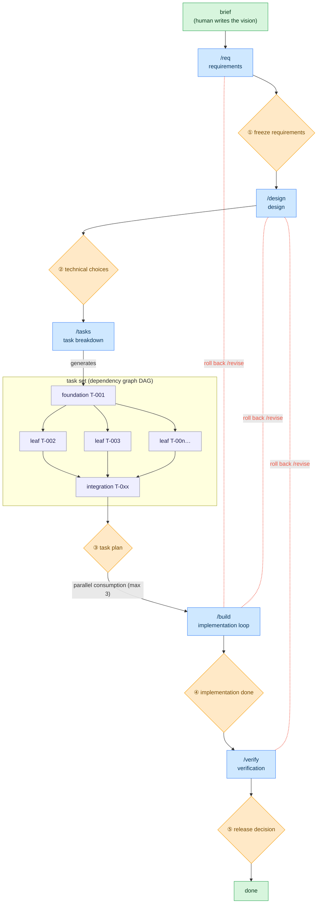

# Loose Rein

**English** | [日本語](README.ja.md)

A coding-agent harness for developing software **Human on the Loop**: the agent does the work,
produces the deliverables, and self-tests from requirements through testing — **humans only
approve/decide at the "gate" on each phase boundary**.

The harness is an **installed CLI** (`rein`); a product repository carries only its *state* —
`.rein/` (the SSOT + lock + materialized prompts/schema) and `docs/` (deliverables).

Works with **Claude Code** and **VS Code GitHub Copilot** (full support, incl. hook-enforced
gates — Copilot's hook mechanism is a VS Code preview feature), and with **Codex** and any other
agent that reads `AGENTS.md` (rules + procedures; gates by convention). See "Agent support".

## How it works



- 🟦 phases the agent runs
- 🟧 gates ①–⑤ — **only the human** opens them
- 🟩 points of human involvement
- 🟪 tasks — a DAG: foundation → parallel leaves → integration

The flow moves top to bottom and **cannot advance while the prerequisite gate is unapproved**;
`/build` consumes the task set in parallel (max 3). Red dotted lines = roll back upstream via
`/revise` (resets the gates from the target onward to `pending` in a chain) — also at the
human's discretion.

## Where to start

Install the CLI once (see "Setup"), then:

| Your situation | Entry point |
|---|---|
| New product from scratch (greenfield) | "Setup" → "Usage" |
| An ongoing repo (brownfield) | "Setup" — `rein init` auto-detects it — then `/onboard` |
| Already set up — next change | Write it into `docs/00-product-brief.md`, run `/req` (if the previous cycle is open, `rein cycle-close --name <slug>` first) |
| Release decided (gate ⑤) | `rein cycle-close --name <slug>` — archive this cycle's docs, reset for the next |
| Refresh the materialized tooling | `rein upgrade` (and `rein uninstall --all` to retract) |
| Lost or resuming | `/status` (tells you the next command), or `rein ui` for a local browser dashboard |

The daily human surface is a handful of verbs (everything else stays behind the dashboard's
buttons — `rein --help` lists them all):

```bash
rein start        # first run: interactive setup wizard; afterwards: where you are + what's next
rein next         # only the next recommended command (--json for integrations)
rein ui           # local dashboard — read the gate's deliverables and approve from the page
rein agent codex  # switch the headless agent CLI (claude | codex | gemini | a custom command)
rein project add  # register a repo the dashboard's project switcher can target
```

With several repos registered via `project add`, the dashboard grows a **project switcher** (a
dropdown in its header) that retargets the whole board without restarting the server; `rein ui`
always adds the repo you launched it from. For a single command, `rein --repo <path> <verb>`
(or `REIN_ROOT=<path>`) targets another repo without changing directory.

## Design principles

Loose Rein is itself a multi-agent orchestration, built on three axes:

- **Architecture** — the simplest structure that works: `rein build` is a **deterministic DAG**
  scheduler; each phase is delegated to a dedicated role agent to separate concerns.
- **Context** — kept minimal: SSOT files hold the truth, role agents read only what they need,
  failures are **summarized not dumped**, deliverable logs are compressed at each checkpoint
  (the `events.ndjson` audit chain never rotates — a record that can disappear is not evidence),
  and memory is tiered (session / cycle / permanent). See "Context budget" in `.rein/prompts/rules/gate-workflow.md`.
- **Tools** — minimal scoped role-agent grants; the quality gate has a retry cap.

## Setup

Prerequisites — a POSIX environment, plus a container runtime (docker/podman) for the sandbox:

| Environment | Status |
|---|---|
| Linux | supported |
| WSL | supported — the way to run this on a Windows machine |
| macOS | supported |
| Windows native | **not validated.** Nothing refuses to start, but the guarantees are not there: file locking falls back to `msvcrt`, directory `fsync` is skipped, and the control plane a parallel build talks to needs a Unix domain socket. Use WSL. |

Install the CLI so its hooks resolve on PATH:

```bash
uv tool install 'git+https://github.com/komoroko/loose-rein-kit.git@v0.1.0'   # provides `rein`
```

The implementation phase (`rein build`) additionally needs a **headless agent CLI** — `claude -p`
by default; switch with `rein agent codex` (sets the role's adapter in `.rein/config.yaml`;
`gemini` also works). Without one `rein build` refuses to start, and `rein doctor` says so.

Seed a repository — the same command for a **greenfield** and a **brownfield** repo (brownfield is
auto-detected; see "Adopting into an existing repository"):

```bash
cd myrepo && git init            # any repo — new or existing

# interactive wizard (recommended; asks only the product name — defaulting to the folder — and a
# brief line. The branch defaults to build/<name>, the source URL is auto-detected from the
# install, and the headless CLI keeps its default — all overridable later, see below.)
rein start
# or non-interactively (idempotent):
#   rein init --name <product> [--branch build/<product>] [--source git+https://github.com/komoroko/loose-rein-kit]

# optional, per developer environment — add an agent's surfaces on demand:
rein install claude         # writes .claude/ wrappers + merges settings.json
rein install copilot        # writes .github/ prompt/agent/hook wrappers
rein install codex          # writes .agents/skills/ + .codex/ agent/hook wrappers
```

Editor/agent integrations typically discover these command/prompt files only at session or
editor start, so open a **new** session (or restart the editor) after running `rein
install claude|copilot|codex` — one already running won't pick up files added mid-session. In that
new session, start with **`/req`** (`rein next` always shows where you are and what to
run — see "Usage").

`rein init` writes **only state**:

- the four SSOT documents (`plan.yaml` / `state.yaml` / `review.yaml` / `config.yaml`,
  placeholder-filled) and the docs scaffolds;
- the materialized `.rein/prompts` + `.rein/schema` + `.rein/AGENTS.rein.md`,
  a pristine scaffold snapshot, and `.rein/rein.lock` (the tool version/source + a
  content hash per installed file);
- a marker-guarded pointer block appended to `AGENTS.md`;
- the work branch, created and switched to (implement there, not on main), with the gate guard
  flipped live.

Nothing else is touched: no build files, no makefile, no agent surfaces unless you
`rein install` them. A brownfield repo also gets the `/onboard` hint.

Keeping the materialized files current:

- `rein sync` — re-materializes the prompts/schema from the installed package (pristine files
  are refreshed; locally modified ones are kept and listed; `--force` overrides; `--check` reports
  drift without writing)
- `rein upgrade` — shows the changelog transition, then refreshes everything the tool
  materialized
- `uv tool upgrade loose-rein-kit` — upgrades the CLI *code* itself

### The sandbox images

Repository code and tests are meant to run in a sealed OCI sandbox rather than on the
host, where a test file an agent wrote would run with your credentials. The Containerfiles ship
with the tool and are materialized under `.rein/oci/`, so the environment a review ran in is
auditable from the repository rather than only from inside the wheel that built it:

```bash
rein oci build --all --write-config # build all three and pin them into config.yaml
rein oci verify                     # every profile's pinned digest is present locally
```

That is the whole setup, and it is what `rein init`, `rein next`, `rein doctor` and the dashboard
all point you at — the wizard offers to run it for you. It needs docker or podman on PATH, builds
each image, pins the digests, flips the profiles to `kind: oci`, and verifies the pins resolve. To
do it one image at a time, or to pin by hand:

```bash
rein oci list                                   # the packaged Containerfiles
rein oci build --profile python --write-config  # builds it, pins it
rein oci build --profile python                 # or just print the sha256: digest to paste
```

`--profile` names a **Containerfile, not an executor profile**: the `quality` profile builds from
`python`, which is what its `containerfile:` key says. Without `--write-config`, `oci build` only
prints the digest and the config key to paste it under. With it, the command rewrites just the
`kind`, `image` and `network_profile` lines of the profiles it built — every comment in
`config.yaml` survives, and it refuses to write a file that no longer parses.

**Re-pinning after gate ③ is allowed, and only re-pinning.** Gate ③ freezes `config.yaml` with the
image pins taken out, because a task that legitimately adds a dependency makes the pinned image
wrong — the closure it needs is not baked in, and a `network: none` sandbox fails the same way on
every retry. Rebuilding that image used to cost a `rein revise --to tasks`: the plan un-froze,
every gate below reset in a chain, and a human re-approved a plan nothing had changed. Now
`rein oci build --write-config` rewrites the pin, records an `environment_repinned` event, and
leaves the gates alone. Everything else in the file is still frozen — `kind`, `network_profile`,
`mount_repo`, the quality gate, the budgets, the guard — so opening a sandbox still needs the human
who approved the narrower one. What the permission is paid for with is visibility: `rein doctor`
reports that the sandbox has moved, and gate ④'s orientation shows the approver that the evidence
they are signing over was produced in an environment gate ③ never saw.

None of the three packaged Containerfiles fit every stack a repository might mix in — a task can
touch a toolchain none of them were built for. A profile can instead set `dockerfile:` — a
repo-relative path (e.g. `.rein/oci/custom/Containerfile`), already frozen alongside the rest of
`config.yaml` once gate ③ freezes it — and `rein oci build --profile <that profile's name>`
builds from it exactly as it would a packaged one. `containerfile:` and `dockerfile:` are
mutually exclusive on one profile.

The Containerfiles pin their base image **by digest**, not by the `python:3.13-slim-bookworm` tag,
and pin `uv` the same way. Two builds a month apart used to produce different images, which made
the digest you pinned a record of what happened to be current rather than something reproducible.
A stale tool is the sharper version of the same problem: an old `uv` does not fail on a
`pyproject.toml` it cannot fully parse, it warns and silently drops the whole `[tool.uv]` table —
a sandbox-only divergence from your host, buried in a build log. The apt packages still resolve
against the live Debian archive, so a rebuild much later can still shift; what the pins guarantee
is that the interpreter, the resolver and the base filesystem cannot move under an approved review.

**A digest binds which image ran; it does not make that image able to run your step.** The
packaged ones carry python, uv and pytest, run as uid 1000 with a read-only root, and get
`--network none`. This repository is the worked example of the gap: its quality gate calls `make
test` and `make check`, the `python` image has no `make`, and `uv run --frozen` under
`--network none` cannot reach a dependency closure — so pinning here would turn a passing gate
into a failing one. Profiles therefore ship as `kind: host`, `doctor` reports that as a `FAIL`,
and clearing it means writing a Containerfile carrying your own DoD's toolchain and dependency
closure. That is a repository's decision, not a default anyone can ship.

## Repository settings you have to make yourself

Loose Rein reads and diagnoses these; it never sets them. Branch protection, required checks,
and secrets are repository administration — a tool that could grant itself the checks that
judge it would not be a boundary. Set them once, on the hosting side:

| Setting | Why |
|---|---|
| Protect `main`: no direct pushes, PR required | Every gate boundary the harness enforces is on a work branch. A direct push walks around all of them. |
| Required checks: `tests` and `base-side policy check` | `policy-check` is the one check a pull request cannot fake — it reads the head tree from the trusted base side. Required, or it is advisory. |
| Dismiss stale approvals on new commits | An approval is of a diff, not of a branch name. |
| No self-approval on a PR that changes `.rein/` or `.github/workflows/` | Those are the boundary itself. |
| Secret scanning / gitleaks in CI | The commit-stage hook only protects the developer who installed it. |

`rein doctor` reports the one part it can see locally: whether a workflow runs
`rein policy-check` (WARN when nothing does). The rest lives with whoever administers the
repository, and the first `policy-check` run — the commit that introduces it — is not
self-verified, because there is no earlier base-side verifier to check it.

## Adopting into an existing repository (brownfield)

There is no separate adopt command — `rein init` is the single entry point and **auto-detects**
an existing codebase (a `src/`, `package.json`, `pyproject.toml`, …). In that mode it:

- scopes `config.yaml`'s `guard.paths` to the docs deliverables only, so pending gates never freeze
  your existing code (re-enable code paths like `src/: tasks` when ready);
- fills the quality-gate test/check commands from your tooling when recognizable (override with
  `--test-cmd` / `--check-cmd`);
- annotates `docs/00-product-brief.md` with the adopted-note pointing at `/onboard`.

Existing files are **never overwritten** (idempotent re-runs). Then, inside the repo:

1. **`/onboard`** — surveys the codebase read-only and fills `docs/05-current-state.md` (the
   persistent baseline). Existing behavior is **not** reverse-generated into requirements or done
   tasks; traceability (R-N) covers each cycle's delta only. Half-done work is anchored by an
   **absorb task** that pins the existing partial code green before new work stacks on it.
2. **Delta cycles** — each `brief → /req → … → /verify` pass describes **one change**, closed with
   `rein cycle-close` (same steps as "Usage"). `docs/00-product-brief.md` and
   `docs/05-current-state.md` persist across cycles.
3. **Retract any time** — `rein uninstall claude|copilot|codex` retracts an agent surface (pristine
   files only; the settings merge is reverted entry-by-entry), and `rein uninstall --all`
   removes every materialized artifact and the lock. Your repo state (SSOT, `docs/`) is never
   touched.

## Usage

1. Write a few lines on "what to build" in `docs/00-product-brief.md` (the only starting point a
   human writes).
2. Run these in order — each stops at the end to ask for approval:

   | Step | Command | What happens | Your role |
   |------|----------|--------------|-----------|
   | requirements | `/req`    | structure requirements by sounding out | ① freeze requirements |
   | design | `/design` | approach + technical-choice options | ② decide/approve technical choices |
   | breakdown | `/tasks`  | task tickets with a test approach | ③ approve the task plan |
   | implementation | `/build`  | autonomous loop (test-green condition) | ④ review/approve completion |
   | verification | `/verify` | run functional + non-functional tests | ⑤ decide on release |

3. **Open a gate** yourself — it is the human's act, never the agent's, and there are two places
   to do it. Both check readiness first, print the digests the approval would cover, and reach the
   same single recording path; the receipt records which channel confirmed.

   ```bash
   rein approve build            # readiness check, then:
   #   gate 'build' is ready. This approval will cover:
   #     plan_digest          sha256:…
   #     attested_chain_root  sha256:…
   #   Approve gate 'build'? [y/N] y
   #   gate 'build' opened (GA-BUILD-a1b2c3d4)
   ```

   Or in `rein ui`, from the same pane that just showed you the deliverable — no extra step.

   **What that establishes.** Not that a human approved — nothing in a repository can show that.
   The receipt records that *a* confirmation happened and over which channel, never *which* human;
   there is no identity-bound mode. What does hold is narrower and load-bearing: **an approval
   cannot happen by accident, by default, or by a configuration someone pre-authorized.** Three
   things carry it — the interactive TTY `rein approve` insists on (a piped stdin, a CI job, or an
   agent's captured subprocess all fail it), the dashboard's **single-use launch link**, printed to
   the terminal `rein ui` runs in and readable by nothing that can merely fetch the page, and
   `rein doctor`'s check that no settings file pre-authorizes a gate-opening verb. There is no
   `--force`, and editing a gate line by hand is denied by the guard.

4. **Ask for changes** instead, when the deliverable is not right. This is a first-class answer,
   not a dead end — say no at the prompt, or use the dashboard's *Request changes*:

   ```bash
   rein changes add requirements --target docs/10-requirements.md#R-3 \
                                 --reason "the acceptance criterion is unmeasurable"
   ```

   An open request **holds the gate shut** and lives in `state.yaml`, so it survives the session
   that raised it rather than evaporating with a chat message. The `--target` anchor is the point:
   the agent reads the slice it names and fixes that, instead of re-running the phase over the
   whole document. It answers with `rein changes address <id> --note <what changed>`, which
   unblocks the gate and puts the note on your approval screen — approving is what closes it.
   Raising one needs no authority of any kind, which is why the dashboard offers it freely: it can
   only ever *narrow* what happens next.

5. **Roll back** on an upstream defect *after* a gate was approved: `/revise <phase>` resets gates
   from the target onward and marks task impact (`rein revise --impacted T-00x` sets seeds and
   their transitive dependents to `needs-revision`). There is no automatic, config-driven
   invalidation — only `--impacted`'s named seeds and their dependents ever move. Pick seeds
   narrowly: naming an early foundation task pulls in everything that (transitively) depends on
   it, which for most DAGs is most of the plan — that is the closure doing its job, not a bug, but
   it means the seed choice is the actual scoping decision to get right.
6. **Check progress** anytime:
   - `rein next` — just the next recommended command (`--json` for integrations)
   - `rein status` — leads with **Waiting on you**: everything standing between the repo and
     its next gate, worst first, each with a severity and the command that clears it. The blocking
     rows are the same list `rein approve <gate> --check` refuses on, so the board can never
     say "nothing needs attention" about a gate that will not open.
   - `/status` — the same board in chat, plus the task DAG
   - `rein ui` — the dashboard: an Overview board carrying that queue; a **Review tab** where
     the gate under decision is read and approved in one pane — it opens on the **scope** (the
     commit range, how much was read, what could *not* be, and whether the change fits one review
     session), then **orient**: what this cycle delivered, which dependencies and migrations moved,
     which sandbox and network posture each quality-gate step ran under, **what the change now
     requires of a person** — the operator-facing behaviour read out of the code, sorted by whether
     any task declared it at gate ③, with what nobody declared first and the file *as it ends up*
     one click away — what the gate established, what is still open (including what the implementer
     said about each task that did not land), and the Expected/Actual comparison — all derived from
     the SSOT, none of it asked of you. Only then the **Decision
     Cards**: every unsettled claim, gap, ungrounded extra behaviour, and security finding, one
     card each, with its evidence attached. Unanswered high/critical cards block the freeze;
     a Tasks tab (DAG, layer progress); an Activity tab
     (live event feed, operations). The page can notify you when a gate or escalation starts
     waiting (opt-in bell; the tab title/favicon always show it). Actions stay a fixed whitelist —
     reads, fixed diagnostics (doctor, tests), and decision recording (approve / resolve / revise /
     cycle-close); phase execution and push/PR/merge are deliberately absent.
   - `rein dag --mermaid` — render the task dependency diagram
7. **Ship as a PR**: `rein pr-draft` assembles the PR body from the SSOT into
   `.rein/pr-draft.md` (read-only); creating/pushing the PR stays yours.
8. **Close the cycle** after gate ⑤: `rein cycle-close --name <slug>` archives to
   `docs/archive/<date>-<slug>/`, restores fresh scaffolds, and resets gates/phase. A human
   operation, like opening a gate.

> **No stalling during approval waits**: a notification fires on reaching a gate, and while
> waiting the agent pulls forward only **outcome-independent** work (environment setup,
> investigation, test-harness setup) — throwaway-by-default and recorded as speculative-work
> events. It does nothing that pre-empts the approval outcome, so the gate's strictness
> is preserved.

### Running the implementation phase autonomously

Canon: `.rein/prompts/commands/build.md` + `AGENTS.md`.

**`rein build`** decides which tasks, at what parallelism, in what merge order, and when to stop —
deterministically from `config.yaml` + `plan.yaml` + `state.yaml`, not by LLM discretion
(`--dry-run` checks the control flow without calling the agent CLI/git). There is no hand-driven
equivalent: `state.yaml` is machine-written (`rein guard` denies edits to it) and a leaf's
decisions reach the audit chain only through the control plane the orchestrator serves.

The rules:

- A task is done only after **passing the quality-gate pipeline** — `quality_gate` in
  `config.yaml` is the **single DoD definition** (default: `test` → `check` → a
  `/code-review`+`/simplify` review step → a real-launch smoke test for runnable deliverables).
  Each step has its own retry budget; exhausting it → `blocked`. Set the smoke step
  `required: true` once the deliverable is runnable, so a forgotten launch check refuses to build.
  A step can name `paths:` (glob patterns) to run only for a task whose diff touches them — a
  repo that mixes several independently-testable stacks is not forced to pay every stack's cost
  on every task. This is a config decision frozen at gate ③, not
  a knob a task's own ticket can turn: a step naming no `paths:` still runs for every task, and
  an unresolved diff (a fresh worktree, before anything has changed yet) never reads as "nothing
  applies" — it runs the full DoD.
- **Parallel leaves run isolated** via `git worktree` (up to 3, `max_parallel`), merged into the
  work branch in ascending-id order. After a batch merges ≥2 leaves, the cmd steps re-run on the
  merged branch (integration gate). Every path a task changed is re-checked against the gate
  rules right after its implementer runs — not only at merge, so a worktree that never gets that
  far still cannot carry an undetected gate violation — and again before any merge; a violation
  escalates (`gate_violation`) and blocks instead of landing.
- An unsolvable task → `blocked`; an upstream defect → `needs-revision`, escalated, loop stops.
  The orchestrator **never touches `gates.build`** (only the human opens a gate).
- **A machine's failure is never recorded as a task's verdict.** An agent that never launched
  (capacity exhausted, the CLI not on PATH, a supervisor's signal) or a step that could not be
  run at all (no container runtime, no pinned image) produced no judgement about the code, so it
  spends no retry budget, marks no task, and stops the run. Leaves that did pass still merge.

#### Exit codes, and running it unattended

`rein build` is one command, not an iteration: its exit is the signal, so nothing should poll a
run in progress. The code says what to do next.

| code | meaning | what to do |
|---|---|---|
| `0` | every task is done | go to gate ④ |
| `1` | a task could not pass the gate, or the frontier is empty with work left | a human reads the escalation |
| `2` | it refused to start, or the machine failed in a way waiting cannot fix | repair what it names |
| `3` | the machine failed in a way time fixes — capacity exhausted, a signal, another run holding the lock. **Nothing was marked, no budget spent** | re-run later; it continues |

An agent **session or usage limit is a normal event** on a run of any length, not an incident.
The loop exits `3` at once rather than sleeping on it — a limit that lifts in hours has no
business holding the build lock and a set of worktrees — so the waiting belongs to whatever
re-runs the command. `rein build --supervise` carries exactly this recipe in-process (same
semantics, only `3` is retried, each attempt a fresh run against the current `state.yaml`):

```sh
rein build --supervise   # [--supervise-interval-sec N], default 900

# equivalent, if something outside `rein` should own the interval/backoff instead:
while :; do
  rein build && break
  rc=$?; [ "$rc" -eq 3 ] || exit "$rc"   # anything else needs a human
  sleep 900
done
```

Each unfinished task is left `todo` with its worktree in place; the next run finalizes and
salvages that work onto the leaf's branch, so the implementer **continues rather than
restarts**. `rein resume` and `rein doctor` both report the stop when you come back.

> **DoD commands are the project's own**: `quality_gate` names them once (the shipped
> defaults `make test` / `make check` are placeholders — `rein init` fills detected commands
> in a brownfield repo; substitute yours otherwise).

### Security review

Three layers:

- **gitleaks** at pre-commit (false positives → `.gitleaksignore`)
- a **structured security review**, folded into the grounded review at gate ④ — `rein review
  generate` runs it bound to the reviewed HEAD, and a blocking finding blocks the gate
- a **security review + a dependency audit** in `/verify`

The findings are structured (severity + code anchor + blocking flag), not prose, and a later commit
leaves the review stale until it is regenerated.

### GitHub Issues integration (optional)

**Off by default.** Enable with `github.enabled: true` (needs the `gh` CLI + a GitHub remote;
auto-skips if absent). `rein issue-sync` **one-way-mirrors** the plan's tasks to Issues — one issue
per T-NNN, matched by a hidden `<!-- rein:T-NNN -->` marker, labeled `kind:*` / `status:*` /
`risk:*` / `claim:*` (auto-created). Edits on the Issues side are never read back (`plan.yaml` + `state.yaml` stay
SSOT). Writing issues is outward-facing, so the opt-in is the consent.

## Troubleshooting

- **First, `rein doctor`** — a read-only diagnosis of the whole setup (PATH binaries,
  plan/state/review consistency, gate-chain invariant, hook registration, worktree leftovers, open
  escalations, review freshness, sandbox pinning, lock health, schema validation). Most situations below
  surface here.
- **A task went `blocked`** — the quality gate failed within its retry budget. Read the escalation
  (`rein events --render`), fix the cause (or the ticket), then put the task back on the frontier
  with **`rein task reset T-NNN --reason "…"`** and re-run `rein build`. (Not by editing
  `state.yaml`: it is written only inside a Central Store transaction, and `rein guard` denies
  the hand edit. The verb is that transaction, with your reason recorded beside the change; it
  keeps the handoff so the retry budget is not silently refilled — `--fresh` discards it and
  says so.) The escalation stays in the log — it is append-only and has no `resolve` verb; you
  conclude it in the retrospective at `/verify`. If it's an upstream defect, `/revise <phase>`
  instead.
- **The run stopped and nothing looks wrong** — no task blocked, no escalation, the board
  unchanged. That is a machine failure, not a task's: an agent capacity limit, a killed process,
  a missing CLI. `rein doctor` and `rein resume` name it. If it exited `3`, just re-run
  `rein build` when capacity is back — every task kept its status and retry budget, and the
  preserved work is picked up automatically.
- **Loop interrupted** (Ctrl-C, crash) — just re-run `rein build`, in this terminal or another; it
  resets `in-progress` tasks to `todo` and cleans leftover worktrees on startup. An interrupted
  leaf's commits are kept on a salvage branch and merged back into the next attempt's worktree
  (a conflict is reported, never forced), and `state.yaml.tasks.<id>.handoff` carries the failing
  step, its output, and the retry budget actually left — so the retry continues rather than
  restarts.
- **Edit denied by the gate guard** — you're editing a next-phase deliverable while its gate is
  `pending`; that's the mechanism working. Get the gate approved, or roll back with `/revise`.
  There is no emergency hatch: a bypass key like `gates.enforce_hook` is refused outright, and
  CI's base-side `policy-check` fails a pull request that tries to bring one in.
- **"template placeholders"** — run `rein start` (or `rein init --name <product>`) first.
- **`rein: command not found` in a hook** — install the CLI on PATH (`uv tool install
  git+<the rein repo>`); `rein doctor` FAILs when the hook binary is unresolvable.
- **`/req` (or other phase commands) don't show up in your agent** — the agent surface is
  opt-in and not run automatically by `rein start`/`init`: run `rein install
  claude` (writes `.claude/commands/` + merges `.claude/settings.json`) or `rein install
  copilot` (writes the `.github/` wrappers), matching whichever agent you use. These are
  typically discovered only at session/editor start, so also open a **new** session (or
  restart the editor) afterward — one already running won't pick up files added mid-session.

## Repository layout

| Path | Role |
|------|------|
| `.rein/plan.yaml` | the frozen Expected Model: one claim per requirement, and the task DAG |
| `.rein/state.yaml` | mutable state: phase, gate approvals, task status |
| `.rein/review.yaml` | the machine review and the human review, digested separately |
| `.rein/events.ndjson` | the hash-chained audit log — every state change's machine truth (`rein events`; created on the first event) |
| `.rein/config.yaml` | deterministic-execution knobs + the single DoD (`quality_gate`) |
| `.rein/rein.lock` | the document format, tool version/source, and a content hash per installed file |
| `.rein/schema/` | JSON Schemas for the SSOT documents (editor validation; `rein doctor`) — materialized |
| `.rein/prompts/` | the shared phase procedures, role definitions, and phase-scoped rules modules (`rules/`) every agent reads — materialized |
| `.rein/AGENTS.rein.md` | the operating-rules body, imported by the agent surfaces — materialized |
| `AGENTS.md` / `CLAUDE.md` | the agent-neutral operating rules / the Claude Code capability mapping (Claude Code reads CLAUDE.md, not AGENTS.md; its `@AGENTS.md` import loads the rules exactly once. `rein install claude` writes the mapping block and the `.claude/` wrappers into a product repo) |
| `.claude/`, `.github/` | per-agent entry points, role wrappers, and gate-guard hook registration (opt-in via `rein install`) |
| `docs/` | phase deliverables (requirements, design, ADR, task tickets, test plan) |

The orchestration code itself lives in the installed `rein` package, not in the repo.

## Agent support

The rules (`AGENTS.md`) and procedures (`.rein/prompts/`) name human-interaction points with a
**capability vocabulary**; each agent's mapping file says how to realize it.

| Capability | Claude Code | VS Code Copilot | Codex |
|---|---|---|---|
| phase entry points | slash commands (`.claude/commands/`) | prompt files (`.github/prompts/`) | skills `$req` … (`.agents/skills/`) |
| gate enforcement | PreToolUse hook + commit-stage check | same hook via agent hooks (preview) + commit-stage check | same hook on `apply_patch` (`.codex/hooks.json`) + commit-stage check |
| structured questions | AskUserQuestion | numbered options in chat | numbered options in chat |
| approval presentation | plan mode + ExitPlanMode | Plan mode / explicit "approve" | explicit "approve" |
| role delegation | subagents | custom agents `@architect` … | subagents (`.codex/agents/*.toml`), explicit |
| autonomous build | `rein build` | `rein build` | `rein build` |
| pending-gate notification | PushNotification | end of turn | end of turn |

An agent with no mapping of its own (one that only reads AGENTS.md) follows the degradation
column in `AGENTS.md`'s capability vocabulary table.

- Agent surfaces are opt-in — `rein install claude|copilot|codex` writes them, and they invoke
  the installed `rein` CLI (so `uv tool install` is a prerequisite of the hooks).
- The Codex surfaces are **unverified against a live Codex**: the hook payload shape and the skill
  and subagent discovery paths were established from openai/codex's source and its published
  documentation, not observed in a running session (the same footing `docs/10-requirements.md`
  puts the codex / gemini adapters on). Codex also reads project-scoped config **only once the
  project is trusted**; until then only the commit-stage check applies.
- On every host, writes made **through the shell** (`sed -i`, a heredoc patch) miss the edit-time
  hook's matcher. The commit-stage `rein guard --check-diff` is what catches those.
- Agent hooks in VS Code Copilot are a **preview** feature (re-verified 2026-07 against VS Code
  v1.110: still preview; the events and file format this repo uses are current) — if off, the
  gates still hold by convention.
- Parallel leaf tasks degrade to serial where delegation isn't available. `rein doctor`
  reports which hook hosts are registered.
- For maintainers: VS Code tool identifiers are not versioned by the template — if one is renamed
  upstream, fix the Copilot mapping's tool table and `.github/agents/*.agent.md` only (the shared
  role bodies never name tools).
