# Loose Rein

**English** | [日本語](README.ja.md)

A coding-agent harness for developing software **Human on the Loop**: the agent does the work,
produces the deliverables, and self-tests from requirements through testing — **humans only
approve/decide at the "gate" on each phase boundary**.

The harness is an **installed CLI** (`rein`); a product repository carries only its *state* —
`.rein/` (the SSOT + lock + materialized prompts/schema) and `docs/` (deliverables).

Works with **Claude Code** and **VS Code GitHub Copilot** (full support, incl. hook-enforced
gates — Copilot's hook mechanism is a VS Code preview feature), and with **Codex** and any other
agent that reads `AGENTS.md` (rules + procedures; gates by convention). See "Agent support".

## How it works

```mermaid
flowchart LR
    brief["brief<br/>(human writes the vision)"]:::human
    req["/req<br/>requirements"]:::agent
    g1{"① freeze requirements"}:::gate
    design["/design<br/>design"]:::agent
    g2{"② technical choices"}:::gate
    tasks["/tasks<br/>task breakdown"]:::agent
    g3{"③ task plan"}:::gate
    build["/build<br/>implementation loop"]:::agent
    g4{"④ implementation done"}:::gate
    verify["/verify<br/>verification"]:::agent
    g5{"⑤ release decision"}:::gate
    done["done"]:::human

    subgraph TASKS["task set (dependency graph DAG)"]
        direction TB
        T1["foundation T-001"]:::task
        T2["leaf T-002"]:::task
        T3["leaf T-003"]:::task
        Tn["leaf T-00n…"]:::task
        TI["integration T-0xx"]:::task
        T1 --> T2
        T1 --> T3
        T1 --> Tn
        T2 --> TI
        T3 --> TI
        Tn --> TI
    end

    brief --> req --> g1 --> design --> g2 --> tasks
    tasks -->|generates| T1
    TI --> g3
    g3 -->|"parallel (max 3)"| build
    build --> g4 --> verify --> g5 --> done

    RV(("/revise")):::revise
    g1 -.- RV
    g2 -.- RV
    RV -.- g4
    RV -.- g5

    classDef agent fill:#cfe8ff,stroke:#3b82f6,color:#06325e;
    classDef gate fill:#ffe9c7,stroke:#f59e0b,color:#7a4a00;
    classDef human fill:#d7f5dd,stroke:#22a04b,color:#0b3d1d;
    classDef task fill:#eeeeff,stroke:#8888aa,color:#222255;
    classDef revise fill:#fff5f5,stroke:#ee5544,color:#ee5544;
    linkStyle 18,19,20,21 stroke:#ee5544,color:#ee5544,stroke-width:1.5px;
```



- 🟦 phases the agent runs
- 🟧 gates ①–⑤ — **only the human** opens them
- 🟩 points of human involvement
- 🟪 tasks — a DAG: foundation → parallel leaves → integration

The flow moves left to right and **cannot advance while the prerequisite gate is unapproved**;
`/build` consumes the task set in parallel (max 3). Red dotted lines = roll back upstream via
`/revise` (resets the gates from the target onward to `pending` in a chain) — also at the
human's discretion.

## Where to start

Install the CLI once (see "Setup"), then:

| Your situation | Entry point |
|---|---|
| New product from scratch (greenfield) | "Setup" → "Usage" |
| An ongoing repo (brownfield) | "Setup" — `rein init` auto-detects it — then `/onboard` |
| Already set up — next change | Write it into `docs/00-product-brief.md`, run `/req` (if the previous cycle is open, `rein cycle-close --name <slug>` first) |
| Release decided (gate ⑤) | `rein cycle-close --name <slug>` — archive this cycle's docs, reset for the next |
| Refresh the materialized tooling | `rein upgrade` (and `rein uninstall --all` to retract) |
| Lost or resuming | `/status` (tells you the next command), or `rein ui` for a local browser dashboard |

The daily human surface is a handful of verbs (everything else stays behind the dashboard's
buttons — `rein --help` lists them all):

```bash
rein start        # first run: interactive setup wizard; afterwards: where you are + what's next
rein next         # only the next recommended command (--json for integrations)
rein ui           # local dashboard — read the gate's deliverables and approve from the page
rein agent codex  # switch the headless agent CLI (claude | codex | gemini | a custom command)
rein project add  # register a repo the dashboard's project switcher can target
```

With several repos registered via `project add`, the dashboard grows a **project switcher** (a
dropdown in its header) that retargets the whole board without restarting the server; `rein ui`
always adds the repo you launched it from. For a single command, `rein --repo <path> <verb>`
(or `REIN_ROOT=<path>`) targets another repo without changing directory.

## Design principles

- **Architecture** — `rein build` is a deterministic DAG scheduler; each phase runs as a
  dedicated role agent.
- **Context** — SSOT files hold the truth; role agents read only what they need; the
  `events.ndjson` audit log never rotates. Detail: "Context budget" in
  `.rein/prompts/rules/gate-workflow.md`.
- **Tools** — minimal scoped role-agent grants; the quality gate has a retry cap.

## Setup

Prerequisites — a POSIX environment, plus a container runtime (docker/podman) for the sandbox:

| Environment | Status |
|---|---|
| Linux | supported |
| WSL | supported — the way to run this on a Windows machine |
| macOS | supported |
| Windows native | **not validated.** Nothing refuses to start, but the guarantees are not there: file locking falls back to `msvcrt`, directory `fsync` is skipped, and the control plane a parallel build talks to needs a Unix domain socket. Use WSL. |

Install the CLI so its hooks resolve on PATH:

```bash
uv tool install 'git+https://github.com/komoroko/loose-rein-kit.git@vX.Y.Z'   # provides `rein`
# replace vX.Y.Z with the latest release tag: https://github.com/komoroko/loose-rein-kit/releases
```

The implementation phase (`rein build`) additionally needs a **headless agent CLI** — `claude -p`
by default; switch with `rein agent codex` (sets the role's adapter in `.rein/config.yaml`;
`gemini` also works). Without one `rein build` refuses to start, and `rein doctor` says so.

Seed a repository — the same command for a **greenfield** and a **brownfield** repo (brownfield is
auto-detected; see "Adopting into an existing repository"):

```bash
cd myrepo && git init            # any repo — new or existing

# interactive wizard (recommended; asks only the product name — defaulting to the folder — and a
# brief line. The branch defaults to build/<name>, the source URL is auto-detected from the
# install, and the headless CLI keeps its default — all overridable later, see below.)
rein start
# or non-interactively (idempotent):
#   rein init --name <product> [--branch build/<product>] [--source git+https://github.com/komoroko/loose-rein-kit]

# optional, per developer environment — add an agent's surfaces on demand:
rein install claude         # writes .claude/ wrappers + merges settings.json
rein install copilot        # writes .github/ prompt/agent/hook wrappers
rein install codex          # writes .agents/skills/ + .codex/ agent/hook wrappers
```

Editor/agent integrations typically discover these command/prompt files only at session or
editor start, so open a **new** session (or restart the editor) after running `rein
install claude|copilot|codex` — one already running won't pick up files added mid-session. In that
new session, start with **`/req`** (`rein next` always shows where you are and what to
run — see "Usage").

`rein init` writes **only state**:

- the four SSOT documents (`plan.yaml` / `state.yaml` / `review.yaml` / `config.yaml`,
  placeholder-filled) and the docs scaffolds;
- the materialized `.rein/prompts` + `.rein/schema` + `.rein/AGENTS.rein.md`,
  a pristine scaffold snapshot, and `.rein/rein.lock` (the tool version/source + a
  content hash per installed file);
- a marker-guarded pointer block appended to `AGENTS.md`;
- the work branch, created and switched to (implement there, not on main), with the gate guard
  flipped live.

Nothing else is touched: no build files, no makefile, no agent surfaces unless you
`rein install` them. A brownfield repo also gets the `/onboard` hint.

Keeping the materialized files current:

- `rein sync` — re-materializes the prompts/schema from the installed package (pristine files
  are refreshed; locally modified ones are kept and listed; `--force` overrides; `--check` reports
  drift without writing)
- `rein upgrade` — shows the changelog transition, then refreshes everything the tool
  materialized
- `uv tool upgrade loose-rein-kit` — upgrades the CLI *code* itself

### The sandbox images

`rein doctor` fails until repository code and tests run in a sandbox rather than on the host, so
a test file an agent wrote never runs with your credentials. Before your first `/build`:

```bash
rein oci build --all --write-config # build and pin the three packaged images (needs docker/podman)
rein oci verify                     # confirm the pins are present
```

`rein init`, `rein next`, and the dashboard all prompt for this at the right time; the wizard can
run it for you. Detail (custom Containerfiles, re-pinning, runtime flags): the `SANDBOXES`
comment block in `.rein/config.yaml`.

## Repository settings you have to make yourself

Loose Rein reads and diagnoses these; it never sets them. Branch protection, required checks,
and secrets are repository administration — a tool that could grant itself the checks that
judge it would not be a boundary. Set them once, on the hosting side:

| Setting | Why |
|---|---|
| Protect `main`: no direct pushes, PR required | Every gate boundary the harness enforces is on a work branch. A direct push bypasses all of them. |
| Required checks: `tests` and `base-side policy check` | `policy-check` is the one check a pull request cannot fake — it reads the head tree from the trusted base side. Required, or it is advisory. |
| Dismiss stale approvals on new commits | An approval is of a diff, not of a branch name. |
| No self-approval on a PR that changes `.rein/` or `.github/workflows/` | Those are the boundary itself. |
| Secret scanning / gitleaks in CI | The commit-stage hook only protects the developer who installed it. |

`rein doctor` reports the one part it can see locally: whether a workflow runs
`rein policy-check` (WARN when nothing does). The rest lives with whoever administers the
repository, and the first `policy-check` run — the commit that introduces it — is not
self-verified, because there is no earlier base-side verifier to check it.

## Adopting into an existing repository (brownfield)

There is no separate adopt command — `rein init` is the single entry point and **auto-detects**
an existing codebase (a `src/`, `package.json`, `pyproject.toml`, …). In that mode it:

- scopes `config.yaml`'s `guard.paths` to the docs deliverables only, so pending gates never freeze
  your existing code (re-enable code paths like `src/: tasks` when ready);
- fills the quality-gate test/check commands from your tooling when recognizable (override with
  `--test-cmd` / `--check-cmd`);
- annotates `docs/00-product-brief.md` with the adopted-note pointing at `/onboard`.

Existing files are **never overwritten** (idempotent re-runs). Then, inside the repo:

1. **`/onboard`** — surveys the codebase read-only and fills `docs/05-current-state.md` (the
   persistent baseline). Existing behavior is **not** reverse-generated into requirements or done
   tasks; traceability (R-N) covers each cycle's delta only. Half-done work is anchored by an
   **absorb task** that pins the existing partial code green before new work stacks on it.
2. **Delta cycles** — each `brief → /req → … → /verify` pass describes **one change**, closed with
   `rein cycle-close` (same steps as "Usage"). `docs/00-product-brief.md` and
   `docs/05-current-state.md` persist across cycles.
3. **Retract any time** — `rein uninstall claude|copilot|codex` retracts an agent surface (pristine
   files only; the settings merge is reverted entry-by-entry), and `rein uninstall --all`
   removes every materialized artifact and the lock. Your repo state (SSOT, `docs/`) is never
   touched.

## Usage

1. Write a few lines on "what to build" in `docs/00-product-brief.md` (the only starting point a
   human writes).
2. Run these in order — each stops at the end to ask for approval:

   | Step | Command | What happens | Your role |
   |------|----------|--------------|-----------|
   | requirements | `/req`    | structure requirements by sounding out | ① freeze requirements |
   | design | `/design` | approach + technical-choice options | ② decide/approve technical choices |
   | breakdown | `/tasks`  | task tickets with a test approach | ③ approve the task plan |
   | implementation | `/build`  | autonomous loop (test-green condition) | ④ review/approve completion |
   | verification | `/verify` | run functional + non-functional tests | ⑤ decide on release |

3. **Open a gate** yourself — it is the human's act, never the agent's, and there are two places
   to do it. Both check readiness first, print the digests the approval would cover, and reach the
   same single recording path; the receipt records which channel confirmed.

   ```bash
   rein approve build            # readiness check, then:
   #   gate 'build' is ready. This approval will cover:
   #     plan_digest          sha256:…
   #     attested_chain_root  sha256:…
   #   Approve gate 'build'? [y/N] y
   #   gate 'build' opened (GA-BUILD-a1b2c3d4)
   ```

   Or in `rein ui`, from the same pane that just showed you the deliverable — no extra step.

   **An approval cannot happen by accident, by default, or via a pre-authorized config**:
   `rein approve` requires an interactive TTY (a piped stdin, CI job, or agent subprocess all
   fail it), the dashboard uses a single-use launch link printed only to the terminal `rein ui`
   runs in, and `rein doctor` checks that no settings file pre-authorizes a gate-opening verb.
   There is no `--force`, and hand-editing a gate line is denied by the guard.

4. **Ask for changes** instead, when the deliverable is not right. This is a first-class answer,
   not a dead end — say no at the prompt, or use the dashboard's *Request changes*:

   ```bash
   rein changes add requirements --target docs/10-requirements.md#R-3 \
                                 --reason "the acceptance criterion is unmeasurable"
   ```

   An open request **holds the gate shut** and lives in `state.yaml`, so it survives past the
   session that raised it. The `--target` anchor makes the agent fix that slice, not re-run the
   whole phase. It answers with `rein changes address <id> --note <what changed>`, which unblocks
   the gate and shows the note on your approval screen.

5. **Roll back** on an upstream defect *after* a gate was approved: `/revise <phase>` resets gates
   from the target onward. `rein revise --impacted T-00x` marks the named seed tasks and their
   transitive dependents `needs-revision` — nothing moves automatically. Naming an early
   foundation task pulls in everything downstream of it, so pick seeds narrowly.
6. **Check progress** anytime:
   - `rein next` — just the next recommended command (`--json` for integrations)
   - `rein status` — leads with **Waiting on you**: everything standing between the repo and
     its next gate, worst first, each with a severity and the command that clears it. The blocking
     rows are the same list `rein approve <gate> --check` refuses on, so the board can never
     say "nothing needs attention" about a gate that will not open.
   - `/status` — the same board in chat, plus the task DAG
   - `rein ui` — the dashboard: an Overview board with that queue; a **Review tab** for reading
     and approving the gate under decision in one pane (scope → what changed and how it was
     reviewed → what the change now requires of a person → Decision Cards for every unsettled
     claim, gap, or finding, each with its evidence, blocking the freeze until answered); a Tasks
     tab (DAG, layer progress); an Activity tab (live event feed). Optional bell notifies on a
     waiting gate/escalation. Actions are a fixed whitelist — reads, diagnostics, and decision
     recording (approve / resolve / revise / cycle-close); phase execution and push/PR/merge are
     not available here.
   - `rein dag --mermaid` — render the task dependency diagram
7. **Ship as a PR**: `rein pr-draft` assembles the PR body from the SSOT into
   `.rein/pr-draft.md` (read-only); creating/pushing the PR stays yours.
8. **Close the cycle** after gate ⑤: `rein cycle-close --name <slug>` archives to
   `docs/archive/<date>-<slug>/`, restores fresh scaffolds, and resets gates/phase. A human
   operation, like opening a gate.

### Running the implementation phase autonomously

Canon: `.rein/prompts/commands/build.md` + `AGENTS.md`.

**`rein build`** decides which tasks, at what parallelism, in what merge order, and when to stop —
deterministically from `config.yaml` + `plan.yaml` + `state.yaml`, not by LLM discretion
(`--dry-run` checks the control flow without calling the agent CLI/git). There is no hand-driven
equivalent: `state.yaml` is machine-written (`rein guard` denies edits to it) and a leaf's
decisions reach the audit chain only through the control plane the orchestrator serves.

The rules:

- A task is done only once it passes `quality_gate` in `config.yaml` — the **single DoD
  definition** (default: `test` → `check` → a `/code-review`+`/simplify` review step → a
  real-launch smoke test for runnable deliverables; set the smoke step `required: true` once the
  deliverable is runnable). Each step has its own retry budget; exhausting it → `blocked`. A step
  can scope itself to `paths:` (glob patterns) so a repo mixing several stacks doesn't pay every
  stack's cost on every task — frozen at gate ③, not a per-task knob.
- **Parallel leaves run isolated** via `git worktree` (up to `max_parallel`) and merge in
  ascending task-id order; an unsolvable task → `blocked`, an upstream defect →
  `needs-revision` and the loop stops. Only a human opens `gates.build` — the orchestrator never
  touches it.

### Running unattended

`rein build`'s exit code is the signal: `0` done (go to gate ④); `1`/`2` need a human (an
escalation to read, or something to repair); `3` is transient — capacity, a signal, another run
holding the lock — and safe to retry, with nothing marked and no budget spent. `rein build
--supervise` retries `3` automatically (`--supervise-interval-sec`, default 900). See
"Troubleshooting" for what each stop looks like and how to resume.

> **DoD commands are the project's own**: `quality_gate` names them once (the shipped
> defaults `make test` / `make check` are placeholders — `rein init` fills detected commands
> in a brownfield repo; substitute yours otherwise).

### Security review

Three layers:

- **gitleaks** at pre-commit (false positives → `.gitleaksignore`)
- a **structured security review**, folded into the grounded review at gate ④ — `rein review
  generate` runs it bound to the reviewed HEAD, and a blocking finding blocks the gate
- a **security review + a dependency audit** in `/verify`

The findings are structured (severity + code anchor + blocking flag), not prose, and a later commit
leaves the review stale until it is regenerated.

### GitHub Issues integration (optional)

**Off by default.** Enable with `github.enabled: true` (needs the `gh` CLI + a GitHub remote;
auto-skips if absent). `rein issue-sync` **one-way-mirrors** the plan's tasks to Issues — one issue
per T-NNN, matched by a hidden `<!-- rein:T-NNN -->` marker, labeled `kind:*` / `status:*` /
`risk:*` / `claim:*` (auto-created). Edits on the Issues side are never read back (`plan.yaml` + `state.yaml` stay
SSOT). Writing issues is outward-facing, so the opt-in is the consent.

## Troubleshooting

- **First, `rein doctor`** — a read-only diagnosis of the whole setup (PATH binaries,
  plan/state/review consistency, gate-chain invariant, hook registration, worktree leftovers, open
  escalations, review freshness, sandbox pinning, lock health, schema validation). Most situations below
  surface here.
- **A task went `blocked`** — the quality gate failed within its retry budget. Read the escalation
  (`rein events --render`), fix the cause (or the ticket), then put the task back on the frontier
  with **`rein task reset T-NNN --reason "…"`** and re-run `rein build`. (Not by editing
  `state.yaml`: it is written only inside a Central Store transaction, and `rein guard` denies
  the hand edit. The verb is that transaction, with your reason recorded beside the change; it
  keeps the handoff so the retry budget is not silently refilled — `--fresh` discards it and
  says so.) The escalation stays in the log — it is append-only and has no `resolve` verb; you
  conclude it in the retrospective at `/verify`. If it's an upstream defect, `/revise <phase>`
  instead.
- **The run stopped and nothing looks wrong** — no task blocked, no escalation, the board
  unchanged. That is a machine failure, not a task's: an agent capacity limit, a killed process,
  a missing CLI. `rein doctor` and `rein resume` name it. If it exited `3`, just re-run
  `rein build` when capacity is back — every task kept its status and retry budget, and the
  preserved work is picked up automatically.
- **Loop interrupted** (Ctrl-C, crash) — just re-run `rein build`, in this terminal or another; it
  resets `in-progress` tasks to `todo` and cleans leftover worktrees on startup. An interrupted
  leaf's commits are kept on a salvage branch and merged back into the next attempt's worktree
  (a conflict is reported, never forced), and `state.yaml.tasks.<id>.handoff` carries the failing
  step, its output, and the retry budget actually left — so the retry continues rather than
  restarts.
- **Edit denied by the gate guard** — you're editing a next-phase deliverable while its gate is
  `pending`; that's the mechanism working. Get the gate approved, or roll back with `/revise`.
  There is no bypass: a key like `gates.enforce_hook` is refused outright, and CI's base-side
  `policy-check` fails a pull request that tries to add one.
- **"template placeholders"** — run `rein start` (or `rein init --name <product>`) first.
- **`rein: command not found` in a hook** — install the CLI on PATH (see "Setup"); `rein doctor`
  FAILs when the hook binary is unresolvable.
- **`/req` (or other phase commands) don't show up in your agent** — the agent surface is
  opt-in and not run automatically by `rein start`/`init`: run `rein install
  claude` (writes `.claude/commands/` + merges `.claude/settings.json`) or `rein install
  copilot` (writes the `.github/` wrappers), matching whichever agent you use. These are
  typically discovered only at session/editor start, so also open a **new** session (or
  restart the editor) afterward — one already running won't pick up files added mid-session.

## Repository layout

| Path | Role |
|------|------|
| `.rein/plan.yaml` | the frozen Expected Model: one claim per requirement, and the task DAG |
| `.rein/state.yaml` | mutable state: phase, gate approvals, task status |
| `.rein/review.yaml` | the machine review and the human review, digested separately |
| `.rein/events.ndjson` | the hash-chained audit log — every state change's machine truth (`rein events`; created on the first event) |
| `.rein/config.yaml` | deterministic-execution knobs + the single DoD (`quality_gate`) |
| `.rein/rein.lock` | the document format, tool version/source, and a content hash per installed file |
| `.rein/schema/` | JSON Schemas for the SSOT documents (editor validation; `rein doctor`) — materialized |
| `.rein/prompts/` | the shared phase procedures, role definitions, and phase-scoped rules modules (`rules/`) every agent reads — materialized |
| `.rein/AGENTS.rein.md` | the operating-rules body, imported by the agent surfaces — materialized |
| `AGENTS.md` / `CLAUDE.md` | the agent-neutral operating rules / the Claude Code capability mapping (Claude Code reads CLAUDE.md, not AGENTS.md; its `@AGENTS.md` import loads the rules exactly once. `rein install claude` writes the mapping block and the `.claude/` wrappers into a product repo) |
| `.claude/`, `.github/` | per-agent entry points, role wrappers, and gate-guard hook registration (opt-in via `rein install`) |
| `docs/` | phase deliverables (requirements, design, ADR, task tickets, test plan) |

The orchestration code itself lives in the installed `rein` package, not in the repo.

## Agent support

The rules (`AGENTS.md`) and procedures (`.rein/prompts/`) name human-interaction points with a
**capability vocabulary**; each agent's mapping file says how to realize it.

| Capability | Claude Code | VS Code Copilot | Codex |
|---|---|---|---|
| phase entry points | slash commands (`.claude/commands/`) | prompt files (`.github/prompts/`) | skills `$req` … (`.agents/skills/`) |
| gate enforcement | PreToolUse hook + commit-stage check | same hook via agent hooks (preview) + commit-stage check | same hook on `apply_patch` (`.codex/hooks.json`) + commit-stage check |
| structured questions | AskUserQuestion | numbered options in chat | numbered options in chat |
| approval presentation | plan mode + ExitPlanMode | Plan mode / explicit "approve" | explicit "approve" |
| role delegation | subagents | custom agents `@architect` … | subagents (`.codex/agents/*.toml`), explicit |
| autonomous build | `rein build` | `rein build` | `rein build` |
| pending-gate notification | PushNotification | end of turn | end of turn |

An agent with no mapping of its own (one that only reads AGENTS.md) follows the degradation
column in `AGENTS.md`'s capability vocabulary table.

- Agent surfaces are opt-in — `rein install claude|copilot|codex` writes them, and they invoke
  the installed `rein` CLI (so `uv tool install` is a prerequisite of the hooks).
- The Codex surfaces are **unverified against a live Codex**: the hook payload shape and the
  skill/subagent discovery paths come from openai/codex's source and docs, not an observed
  session. Codex also reads project-scoped config **only once the project is trusted**; until
  then only the commit-stage check applies.
- On every host, writes made **through the shell** (`sed -i`, a heredoc patch) miss the edit-time
  hook's matcher. The commit-stage `rein guard --check-diff` is what catches those.
- Agent hooks in VS Code Copilot are a **preview** feature — if off, the gates still hold by
  convention.
- Parallel leaf tasks degrade to serial where delegation isn't available. `rein doctor`
  reports which hook hosts are registered.
