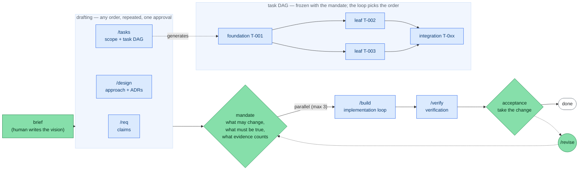

# Loose Rein

**English** | [日本語](README.ja.md)

A coding-agent harness for developing software **Human on the Loop**: the agent does the work and
produces the evidence; a human approves at the phase boundaries — the *gates*.

The harness is an installed CLI (`rein`). A product repository carries only its state: `.rein/`
(the SSOT, the lock, the materialized prompts and schema) and `docs/` (the deliverables).

This page is how to set it up and run it. The always-true rules live in [`AGENTS.md`](AGENTS.md);
`rein help --all` names every verb and `rein <verb> --help` gives its arguments.

## How it works

**A human approves twice, and neither approval is about the order of the work.**



Green marks where a human acts — the brief, the gates, `/revise`. Blue is what the agent runs.
The dotted arrows are a rollback, at the human's discretion.

| Phase | Command | What happens | Your role |
|---|---|---|---|
| drafting | `/req` `/design` `/tasks` | claims, approach, scope and the task DAG — any order | approve the **mandate**: the scope, the claims, the acceptance criteria |
| implementation | `/build` | autonomous loop inside the mandate | nothing — it repairs its own review findings |
| verification | `/verify` | tests, dependency audit, the grounded review | approve **acceptance**: take the change |

The three drafting commands write **one mandate** between them, so they are material for it rather
than gates of their own: run them in any order, and repeat them. The order is free; the content is
not. `rein approve mandate` refuses a plan that states no claim and one that declares no task, so
`/req` and `/tasks` get answered however you reached them; `/design` is the one that may be left
out, and the traceability thread then reports the design dimension as unchecked rather than
passing it. That single approval covers all three, and it freezes `plan.yaml` and `config.yaml`.

Inside an approved mandate, `/build` cannot touch a path outside the mandate's `scope` (`rein
guard` denies it) and cannot finish without the evidence the mandate requires. What it chooses
freely is the order, the parallelism, and the re-runs after a red step; what it cannot do is
re-cut the DAG, since each task's acceptance criteria sit in the frozen `plan.yaml`. A new
breakdown is `/revise --to mandate`.

**A third kind of gate, when the change has one.** A task whose `operator_surface` declares
`reversible: false` — data that moves, a version published, a charge made — gets a gate named
after it, and `rein build` stops in front of that task until `rein approve T-NNN`. These appear
when the mandate is approved, out of the plan it freezes, so you approve their count as part of
the mandate. There is no ceiling on it: how often you are asked is a property of the change.

## Setup

Six steps. `rein doctor` checks every one of them at any point; when it is green, open a new agent
session and start with `/req`.

**1. Prerequisites** — a POSIX environment, plus a container runtime (docker or podman) for the
sandbox. Linux, WSL and macOS are supported. Windows native is **not validated**: nothing refuses
to start, but file locking falls back to `msvcrt`, directory `fsync` is skipped, and the control
plane a parallel build talks to needs a Unix domain socket. Use WSL.

**2. Install the CLI** so the hooks resolve it on PATH:

```bash
uv tool install 'git+https://github.com/komoroko/loose-rein-kit.git@vX.Y.Z'   # provides `rein`
# replace vX.Y.Z with the latest release tag: https://github.com/komoroko/loose-rein-kit/releases
```

**3. Provide a headless agent CLI** — it is what the implementation phase drives. The default is
`claude`; switch with `rein agent <cli>`. Seven are launchable and they differ in what they can be
*told* (`rein agent --show` prints the current roles; `rein doctor` says which binaries are on
PATH):

| `adapter:` | binary | model | retry continues its session | reports what a launch cost |
|---|---|---|---|---|
| `claude` | `claude` | yes | yes (and forks a shared reading) | yes |
| `codex` | `codex` | yes | yes | yes |
| `gemini` | `gemini` | yes | no | yes |
| `copilot` | `copilot` | yes | no | no |
| `cursor` | `cursor-agent` | yes | no | no |
| `amp` | `amp` | no | no | no |
| `opencode` | `opencode` | yes | no | when its step reports one |

Two constraints follow from the table:

- An adapter that cannot be told a model **refuses** a `model:` written beside it rather than
  launching its own default under that name. The acceptance gate's independence check is derived
  from the model, so a separation written down and not performed is refused where it is written.
- Only `claude` and `codex` read a prompt from stdin; the rest take theirs as an argument, capped
  at 128 KiB by the operating system. A grounded-review reading is usually larger, so on the other
  adapters a reviewer launch is **refused**, naming the two ways out: point the reviewer roles at
  `claude` or `codex`, or lower `review_policy.budgets.max_diff_bytes`. On those CLIs the
  practical bound is a change of ~128 KiB.

Without the binary, `rein build` refuses to start and names the command that installs it.

**4. Seed the repository** — the same command for a new and an existing repo; brownfield is
auto-detected.

```bash
cd myrepo && git init

rein start   # wizard: product name, a one-line brief, the agent surface, the sandbox
# or non-interactively (idempotent):
#   rein init --name <product> [--branch build/<product>]
```

**5. Add your agent's surfaces** — the phase commands (`/req`, `/design`, …) exist only once one
is written. The wizard does this; use these to add a second host, or to fit out a repo seeded
non-interactively:

```bash
rein install claude         # .claude/ wrappers + a settings.json merge
rein install copilot        # .github/ prompt, agent and hook wrappers
rein install codex          # .agents/skills/ + .codex/ wrappers
rein install gemini         # .gemini/ commands and skills + a settings.json merge
```

These files are usually read at session or editor start, so open a **new** session afterwards.

**6. Build the sandbox image** — the quality gate's command steps run repository code and tests in
a sandbox rather than on the host, so a test an agent wrote never runs with your credentials.
`rein doctor` FAILs until the image is pinned:

```bash
rein oci build --all --write-config   # needs docker or podman
```

The packaged image carries python, uv and pytest and has no network — enough for the shipped
default gate and nothing more. A gate that needs a linter, a type checker or a dependency closure
needs an image of its own: write a Containerfile, point the profile at it with `dockerfile:`
instead of `containerfile:`, and rebuild. Detail: the `SANDBOXES` block in `.rein/config.yaml`.

**Boxing the agent CLI as well** is a second, optional box of a different kind, since the two want
opposite things of the network:

```bash
rein oci build --profile agent --build-arg AGENT_CLI=@anthropic-ai/claude-code --write-config
```

Every implementer, reviewer and fixer then runs inside it, with the worktree at `/work`, the
control socket bound in, and **no HOME of yours, no ~/.ssh, no ~/.aws, no docker socket**. It *is*
given egress — an agent that cannot reach its model API does nothing — so it is not a boundary
against exfiltration and does not claim to be; what it buys is that the process writing your code
cannot read the rest of your machine. Leaving it off stays the default, because the image has to
carry the CLI and no packaged one can carry every CLI you might use. `rein doctor`, the dossier
and the acceptance brief always say which way it ran. Disable the adapter's own sandbox when you
box it — nested sandboxes fail at the point the agent writes.

## Daily use

Three verbs are the daily surface; the rest sit behind the dashboard's buttons.

```bash
rein start        # first run: the setup wizard. Afterwards: what moved since you last looked
rein next         # only the next recommended command (--json for integrations)
rein ui           # local dashboard — read the deliverables and approve from the page
```

Set once rather than daily: `rein agent codex` switches the headless agent CLI, and
`rein project add` registers a repo the dashboard can switch to. For a one-off,
`rein --repo <path> <verb>` targets another repo without changing directory.

Then, per cycle:

1. **Write the brief** — a few lines on what to build, in `docs/00-product-brief.md`. The only
   starting point a human writes.

2. **Run the phases** — `rein next` says which is next; `/status` shows the same board in chat
   with the task DAG.

3. **Open a gate** — the human's act, never the agent's. Two places: `rein approve <gate>` at a
   terminal, or the same pane of `rein ui` that just showed you the deliverable. Both check
   readiness first and print the digests the approval will cover.

   ```bash
   rein approve acceptance
   #   gate 'acceptance' is ready. This approval will cover:
   #     plan_digest          sha256:…
   #     attested_chain_root  sha256:…
   #   Approve gate 'acceptance'? [y/N] y
   ```

4. **Ask for changes** — when the deliverable is not right. Say no at the prompt, or use the
   dashboard's *Request changes*:

   ```bash
   rein changes add requirements --target docs/10-requirements.md#R-3 \
                                 --reason "the acceptance criterion is unmeasurable"
   ```

   An open request holds the gate shut and lives in `state.yaml`, so it outlives the session that
   raised it. The `--target` anchor makes the agent fix that slice instead of re-running the phase;
   it answers with `rein changes address <id> --note <what changed>`.

5. **Roll back** — on an upstream defect found *after* a gate was approved, `/revise <phase>`
   resets the gates from there onward. `rein revise --impacted T-00x` marks the named seed tasks
   and their dependents `needs-revision`. Nothing moves automatically, and an early foundation task
   pulls in everything below it, so pick the seeds narrowly.

6. **Check progress** — `rein start` leads with **Waiting on you**: everything between the repo and
   its next gate, worst first, each with the command that clears it. Those rows are the same list
   `rein approve <gate> --check` refuses on, so the board cannot say "nothing needs attention"
   about a gate that will not open. `rein ui` is the same thing as a page — the cycle's gates in a
   spine down the left with a reading room behind each, plus the DAG, the live event log, and
   diagnostics. It streams instead of polling, and its actions are a fixed whitelist: reads,
   diagnostics and decision recording, never phase execution or push. Also `rein dag --mermaid` for
   the dependency diagram, and `rein decisions` / `rein claims` to read the archives back — every
   judgement on record, and what each cycle committed to — oldest cycle first.

7. **Ship** — `rein pr-draft` assembles a PR body from the SSOT into `.rein/pr-draft.md`. Creating
   and pushing the PR stays yours. Or ship a **stack, one pull request per task**: `rein pr-stack`
   cuts the work branch at each task's landing commit and writes one body per slice, `--push` opens
   them as drafts after a confirmation typed at a terminal, and `--ready` lifts them once
   acceptance is approved. A fix is committed onto the slice that introduced the code and carried
   upward by `--restack`, which merges. **A stack is never rebased and never merged in part** —
   either strands every `completed_commit` and gate receipt on commits that no longer exist. Land
   the whole of it with `gh stack merge <top> --merge`, which needs `gh extension install
   github/gh-stack` — `rein doctor` says whether you have it. Optionally `rein issue-sync`
   one-way-mirrors the plan's tasks to GitHub Issues (off by default; edits there are never read
   back).

8. **Close the cycle** — `rein cycle-close --name <slug>` archives to
   `docs/archive/<date>-<slug>/`, restores fresh scaffolds, and resets the gates and the phase. A
   human operation, like opening a gate.

**Being told it is your turn.** The gates decide how often the work stops; how long each stop
lasts is decided by how soon you find out. `rein ui` watches the SSOT for as long as it runs — no
browser needed — and runs your command when the decision waiting on you changes:

```yaml
# $XDG_CONFIG_HOME/rein/notify.yaml   (~/.config/rein/notify.yaml)
command: notify-send "rein"
```

It runs with `REIN_PROJECT`, `REIN_DECISION_ID`, `REIN_HEADLINE`, `REIN_ACTION` and `REIN_URL` set,
on an allowlist that carries no credentials. One decision, one notification, and it says what is
waited on and where — never the evidence, and never the launch secret, which is stripped from
`REIN_URL`. The page it points at is read-only unless that browser already holds a session.

## Keeping the install current

- **`rein sync`** re-materializes the prompts and schema from the installed package: pristine files
  are refreshed, locally modified ones are kept and listed (`--force` overrides, `--check` reports
  drift without writing).
- **`rein upgrade`** shows the changelog transition, then refreshes everything the tool
  materialized.
- **`rein doctor`** is the only command that reaches the network. It asks GitHub whether a newer
  release exists and prints the command that upgrades *this* install — derived from how the install
  was made, because a tag-pinned one and a branch-tracking one need different commands. With no
  `gh`, no network or no VCS origin it says it could not check, never that you are current;
  `REIN_NO_UPDATE_CHECK` skips the question. `rein start` prints that result from doctor's cache
  and never fetches anything itself.

## Authority to open a gate

`gates.<name>` in `.rein/state.yaml` reaches `approved` on exactly one path: a human approval that
`rein` recorded. This is how that stays true while an agent does the work.

- **One recording path, two places to use it** — a terminal or the dashboard's approval footer.
  The receipt binds the digests it covered and records which channel confirmed, never which human.
- **It cannot happen by accident or by config.** `rein approve` requires an interactive TTY, so a
  pipe, a CI job and an agent subprocess all fail it; the dashboard uses a single-use launch link
  printed only to the terminal `rein ui` runs in; and `rein doctor` checks that no settings file
  pre-authorizes a gate-opening verb, including the gitignored local one. There is no `--force`.
- **The agent is fenced out at three stages** — the `rein guard` hook denies the edit,
  `rein guard --check-diff` catches at commit stage what a shell write slipped past the matcher,
  and CI's base-side `rein policy-check` fails a pull request that weakens either. Hand-editing a
  gate line is denied, a key that would disable the hook is refused, and an unreadable gate fails
  closed.
- **Rewinding an approval is a human privilege too.** `/revise` resets gates from the target
  onward in a chain, invalidating the receipts and the review built on them. Nothing rewinds
  automatically.
- **Waiting is not idling, and what was done while waiting is on the record.** While a gate is
  pending, only outcome-independent work may go on — scaffolding, CI setup, read-only
  investigation, fixtures — outside `guard.paths` and throwaway by default, logged in
  `docs/speculative-work.md` with what each row was premised on. A row that cannot name what would
  waste it was not speculative work; it was the deliverable.

## Repository settings you provide

Loose Rein reads and diagnoses these; it never sets them. A tool that could grant itself the checks
that judge it would not be a boundary.

| Setting | Why |
|---|---|
| Protect the base branch: no direct pushes, PR required | Every gate boundary is enforced on a work branch, which a direct push bypasses. |
| Require the test job and the base-side policy check | `policy-check` is the one check a pull request cannot fake — it reads the head tree from the trusted base side. Required, or it is advisory. |
| Dismiss stale approvals on new commits | An approval is of a diff, not of a branch name. |
| No self-approval on a PR that changes `.rein/` or the workflows | Those are the boundary itself. |
| Secret scanning in CI | The commit-stage hook only protects the developer who installed it. |

`rein doctor` reports the part it can see locally: whether a workflow runs `rein policy-check`,
whether the event gives it a base the head cannot choose, and where the `rein` running it came
from. The job itself is worth spelling out, because the order of its steps is load-bearing and it
is not the order every other job uses:

```yaml
  policy-check:
    if: github.event_name == 'pull_request'
    runs-on: ubuntu-latest
    steps:
      - uses: astral-sh/setup-uv@<commit sha>
      # Before the checkout, and from a commit the head did not write: otherwise the pull request
      # chooses the index its own verifier's dependencies resolve from, and they import at startup.
      # `--no-config` keeps a reordering from silently reopening that. `uv tool install` does not
      # put its bin directory on PATH, so name it and add it yourself — on the step, because
      # `runner` is not a context a job-level `env:` may read.
      - env:
          UV_TOOL_BIN_DIR: ${{ runner.temp }}/rein-bin
        run: |
          uv tool install --no-config \
            "git+https://github.com/komoroko/loose-rein-kit.git@<the tag in .rein/rein.lock>"
          echo "$UV_TOOL_BIN_DIR" >> "$GITHUB_PATH"
      - uses: actions/checkout@<commit sha>
        with:
          fetch-depth: 0
      - run: >-
          rein policy-check
          --base-sha '${{ github.event.pull_request.base.sha }}'
          --head-sha '${{ github.event.pull_request.head.sha }}'
          --base-ref '${{ github.event.pull_request.base.ref }}'
          --default-branch 'origin/${{ github.event.repository.default_branch }}'
```

A job already shaped the old way is not failed retroactively: the base side reports what a head
*introduces*, and `rein doctor` is where a pre-existing one gets named.

## Evidence over the agent's account

An agent's account of its own work is self-consistent by construction, so it is never what a gate
is decided on. What is:

- **A claim with no evidence is `unknown`, never prose.** `plan.yaml` freezes one claim per
  requirement — the Expected Model — and `claim_ids` threads each task back to the claim it
  answers, cross-checked by `rein dag --trace`.
- **The grounded review compares Expected against Actual.** It runs a deterministic Coverage
  Manifest, a **blind** extraction of what the code actually does, a structured security review,
  and the comparison of the two. The blind extractor is never given the plan and is launched
  outside the repository so it cannot go and read one — nor the tests, whose names paraphrase the
  requirements it never saw.
- **The change is read in readings, not in one sitting** — one per scoped task, plus a seam over
  what two scopes share and what none covers. Every statement carries the reading it came from, a
  changed path no reading covered makes the manifest `insufficient`, and at `critical` risk the
  change is read whole whatever the configuration says. The merged tree gets a reading of its own
  (`stage: integration`), because what the join makes — duplication, one responsibility in two
  places — was nobody's to see inside a single scope.
- **There is no single `verified`.** Findings sit on three separate axes — integrity, semantic
  support, conformance — and "extra behaviours: 0" appears only with the manifest that earned it.
  A blocking security finding, a diverged high/critical claim, an ungrounded high/critical extra
  behaviour, or an insufficient manifest blocks the gate; a later commit leaves the review stale.
- **Whoever judges does not repair.** The reviewer is launched read-only and writes findings; an
  implementer resolves them and the reviewer looks again, up to `review_policy.repair_rounds`. An
  implementer ends with `rein report --outcome implemented|blocked|needs-revision` — a claim about
  its work, checked against the real diff, never a verdict.
- **`done` means the DoD went green against the tree the task actually produced** — a content
  fingerprint recorded beside the status. An attempt that changed nothing never reaches the gate.
- **Evidence this loop cannot obtain is named as such.** An acceptance criterion marked `external`
  — a staging check, a device, a person — merges the work and parks the task at
  `awaiting-evidence` until somebody records what they saw with `rein evidence record`. That
  record binds the tree it was made against, so changing the code retires it.
- **All of it lands on a hash-chained log.** `.rein/events.ndjson` records every state change and
  why, and a gate receipt pins the chain root, so a deleted or re-hashed line breaks the chain that
  receipt stands on. The sandbox is pinned by digest for the same reason: the environment a review
  ran in cannot change after the review was approved.

What a reading was told to look for is a library rather than a habit: `rein lens --list` prints
every review lens with the condition that makes it apply, `--select <stage>` resolves those
conditions into the plan, and `--stats` gives applied and found counts, so a lens that never finds
anything can be dropped. `rein observe` does the same for the harness itself, printing each figure
beside the claim it tests. There are no thresholds and none are coming: a number with a ceiling on
it gets managed instead of read.

## The build loop

`rein build` decides which tasks, at what parallelism, in what merge order and when to stop —
deterministically from `config.yaml`, `plan.yaml` and `state.yaml`, not by LLM discretion
(`--dry-run` checks the control flow without calling the agent CLI or git). There is no
hand-driven equivalent: `state.yaml` is machine-written, and a leaf's decisions reach the audit
chain only through the control plane the orchestrator serves.

A task is done only once it passes `quality_gate` in `config.yaml`, the **single DoD definition**:
`test`, then `check`, then a `review` step for correctness and simplification, then a `smoke`
launch for runnable deliverables (set that one `required: true` once the deliverable runs). Each
step has its own retry budget, and exhausting it blocks the task; a step can scope itself to
`paths:` so a repo mixing several stacks does not pay every stack's cost on every task. The
commands are the project's own — the shipped defaults are the floor the packaged sandbox can run,
and `rein init` fills in detected ones in a brownfield repo. Parallel leaves run isolated in `git
worktree`s (up to `max_parallel`) and merge in ascending task order.

**Running unattended.** The exit code is the signal: `0` done, `1` or `2` need a human, and `3` is
transient — capacity, a signal, another run holding the lock — and safe to retry with nothing
marked and no budget spent. `rein build --supervise` retries `3` automatically, and
`rein review generate --supervise` does the same for the review pipeline, but never for a request
that did not fit, which is the same size on every attempt.

An agent launch has **no time limit** by default (`execution.agent_timeout_sec: 0`): a clock cannot
tell a model that is working from one that is stuck, and killing a working one makes the retry pay
for it again. Command steps keep their ceiling, because their runtime is knowable.

There is **no spend ceiling** by default either; `execution.max_cost_usd` sets one. It bounds the
cycle's *measured* spend — what the adapters reported, the figure `rein events --cost` prints — and
reaching it stops the loop between batches. Nothing degrades to stay under it: no cheaper model and
no thinner review. Launches an adapter reports no cost for are counted, never priced at zero, so a
cycle where nothing could be priced stops as well, saying it was unbounded rather than free.

## Security

- **gitleaks** at pre-commit; false positives go in `.gitleaksignore`.
- A **structured security review** folded into the grounded review and bound to the reviewed HEAD.
  Findings carry a severity, a code anchor and a blocking flag rather than being prose, and a
  blocking one blocks the gate.
- A **dependency audit** at `/verify`. Acceptance carries the review rather than re-reading the
  code, and adds this one answer the tree does not determine: the database moves while the code
  stands still.

A finding is `open` until the change closes it, and the next generation decides which happened by
re-reading the code it anchored to rather than by asking the reviewer. Gone from the tree, and it
is recorded `resolved` against the head that removed it; still there, and dropping it is refused as
a reviewer clearing its own block. A finding with no anchor is closed by a human's dispute or not
at all.

## Existing repositories (brownfield)

There is no separate adopt command: `rein init` auto-detects an existing codebase. In that mode it
scopes `guard.paths` to the docs deliverables only — so a pending gate never freezes your existing
code — fills the quality-gate commands from your tooling where it recognizes it, and points the
brief at `/onboard`. Existing files are never overwritten. Then, inside the repo:

1. **`/onboard`** surveys the codebase read-only and fills `docs/05-current-state.md`, the
   persistent baseline. Existing behaviour is **not** reverse-generated into requirements or done
   tasks; traceability covers each cycle's delta only. Half-done work is anchored by an *absorb
   task* that pins the existing partial code green before new work stacks on it.
2. **Delta cycles** — each pass from brief to `/verify` describes one change and is closed with
   `rein cycle-close`. The brief and `docs/05-current-state.md` persist across cycles.
3. **Retract at any time** — `rein uninstall claude|copilot|codex|gemini` removes an agent surface
   (pristine files only; the settings merge is reverted entry by entry), and `rein uninstall --all`
   removes every materialized artifact and the lock. Your SSOT and `docs/` are never touched.

## Troubleshooting

**First, `rein doctor`** — a read-only diagnosis of the whole setup, from PATH binaries and hook
registration to plan/state consistency, review freshness, sandbox pinning and schema validation.
Most of the situations below surface there.

- **A task went `blocked`** — the quality gate failed within its retry budget. Read the escalation
  with `rein events --render`, fix the cause, and put the task back on the frontier with
  `rein task reset T-NNN --reason "…"`. Not by editing `state.yaml`: it is written only inside a
  store transaction, and `rein guard` denies the hand edit. The reset keeps the handoff so the
  retry budget is not silently refilled (`--fresh` discards it and says so). If the cause is an
  upstream defect, use `/revise <phase>` instead.
- **The run stopped and nothing looks wrong** — no blocked task, no escalation, the board
  unchanged. That is a machine failure rather than a task's: a capacity limit, a killed process, a
  missing CLI. `rein doctor` and `rein start` name it. On exit `3`, re-run `rein build` when
  capacity is back; every task kept its status and its retry budget.
- **The loop was interrupted** (Ctrl-C, a crash) — re-run `rein build`, here or in another
  terminal. It resets `in-progress` tasks and cleans leftover worktrees on startup, and an
  interrupted leaf's commits are kept on a salvage branch and merged back into the next attempt (a
  conflict is reported, never forced).
- **An edit was denied by the gate guard** — you are editing a next-phase deliverable while its
  gate is pending, which is the mechanism working. Get the gate approved, or roll back with
  `/revise`. There is no bypass.
- **"template placeholders"** — run `rein start` (or `rein init --name <product>`) first.
- **`rein: command not found` in a hook** — the CLI is not on PATH (Setup, step 2).
- **The phase commands do not show up in your agent** — no surface is installed: run
  `rein install claude|copilot|codex|gemini` and open a new session (Setup, step 5).

## Repository layout

`rein init` writes **only state**: the SSOT documents, the docs scaffolds, the materialized prompts
and schema with a pristine snapshot of them, the lock, a marker-guarded pointer block appended to
`AGENTS.md`, and the work branch. No build files, and no agent surfaces unless you `rein install`
them; existing files are never overwritten. The orchestration code lives in the installed package,
not in the repo.

| Path | Role |
|---|---|
| `.rein/plan.yaml` | the frozen Expected Model: one claim per requirement, and the task DAG |
| `.rein/state.yaml` | mutable state: phase, gate approvals, task status |
| `.rein/review.yaml` | the machine review and the human review, digested separately |
| `.rein/events.ndjson` | the hash-chained audit log. Every launch records what the provider billed, so `rein events --cost` answers where a cycle's tokens went, by role |
| `.rein/config.yaml` | the deterministic-execution knobs and the single DoD (`quality_gate`) |
| `.rein/rein.lock` | the document format, the tool version and source, and a content hash per installed file |
| `.rein/schema/`, `.rein/prompts/` | JSON Schemas for the SSOT; the phase procedures, role definitions and rules modules every agent reads — both materialized |
| `AGENTS.md`, `CLAUDE.md` | the agent-neutral operating rules, and the Claude Code capability mapping that imports them |
| `.claude/`, `.github/` | per-agent entry points and gate-guard hook registration, opt-in via `rein install` |
| `docs/` | the phase deliverables, the speculative work log, and the retrospective |

## Agent support

Loose Rein works with **Claude Code** and **VS Code GitHub Copilot** (full support, including
hook-enforced gates), and with **Codex**, **Gemini CLI**, and any other agent that reads
`AGENTS.md` (rules and procedures; gates by convention). The rules name every human-interaction
point with a **capability vocabulary**, and each agent's mapping file says how to realize it; an
agent with no mapping of its own follows the degradation column in `AGENTS.md`.

| Capability | Claude Code | VS Code Copilot | Codex | Gemini CLI |
|---|---|---|---|---|
| phase entry points | slash commands | prompt files | skills | custom commands |
| gate enforcement | PreToolUse hook | agent hooks (preview) | `apply_patch` hook | `BeforeTool` hook |
| structured questions | AskUserQuestion | numbered options in chat | numbered options in chat | numbered options in chat |
| approval presentation | plan mode | plan mode | explicit "approve" | explicit "approve" |
| role delegation | subagents | custom agents | subagents | skills |
| selectable as the build's CLI | `rein agent claude` | `rein agent copilot` | `rein agent codex` | `rein agent gemini` |
| pending-gate notification | PushNotification | end of turn | end of turn | end of turn |

Every host also gets the commit-stage check, which is what holds where a hook does not. Three
caveats: the Codex surfaces are **unverified against a live Codex** (the hook payload shape, the
discovery paths and the adapter's flags come from openai/codex's source and docs rather than an
observed session, and Codex reads project-scoped config only once the project is trusted); agent
hooks in VS Code Copilot are a **preview** feature, and with them off the gates hold by convention;
and parallel leaf tasks degrade to serial where delegation is not available. `rein doctor` reports
which hook hosts are registered.
